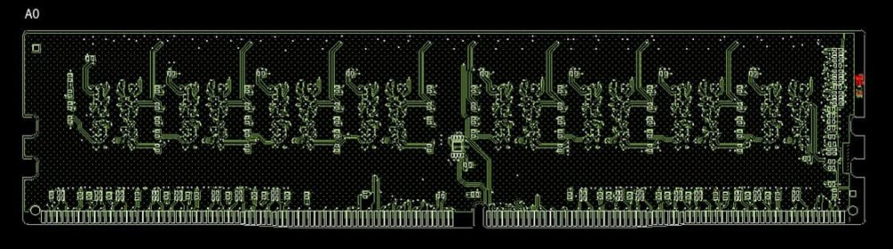
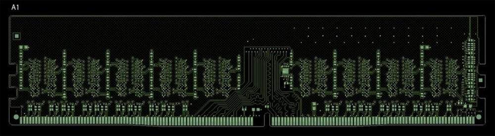
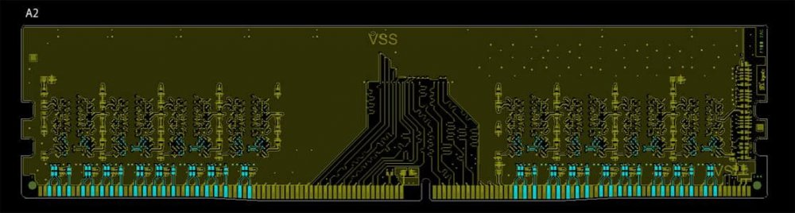
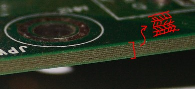
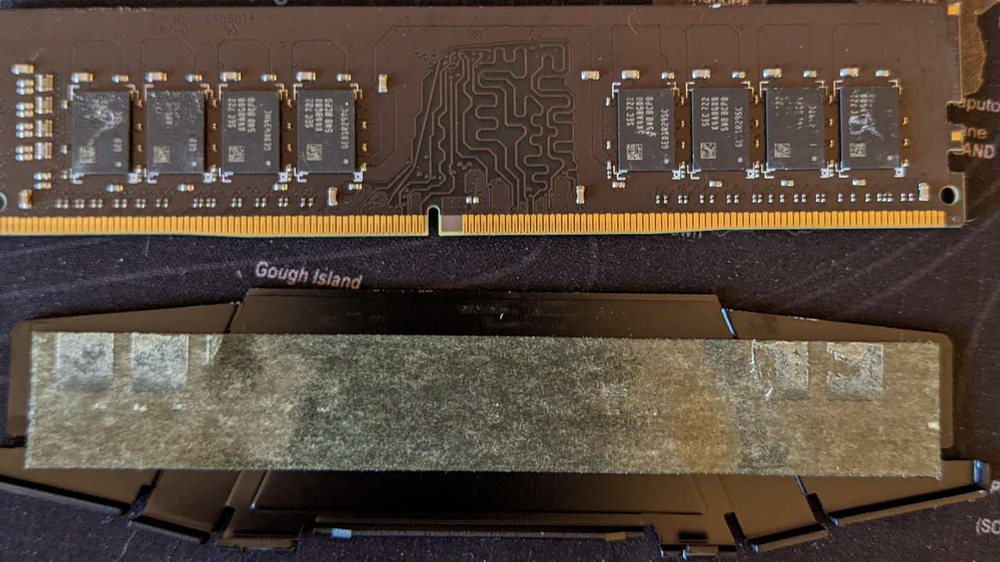
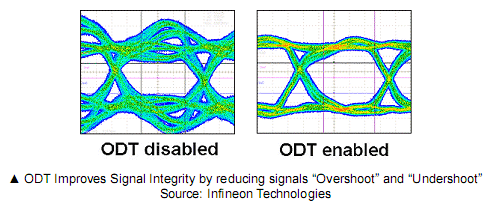
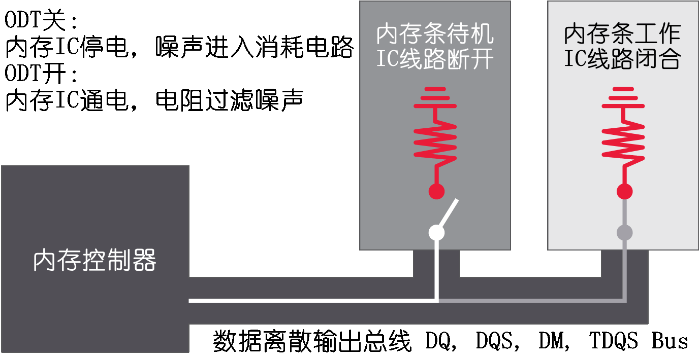
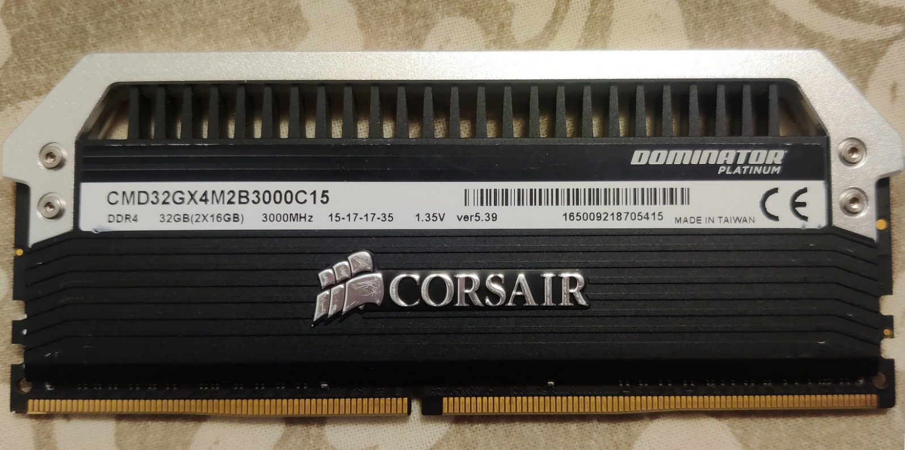
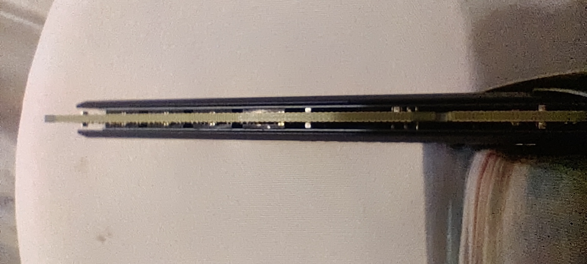

### ❀原创教程，转载本页必须注明链接和作者
#### ❀目前本教程处于发布早期，会频繁更新/修bug，出问题求不锤，超频造成的损失自负哦

**主要资料来源：** Buildzoid (<a href='https://www.youtube.com/channel/UCrwObTfqv8u1KO7Fgk-FXHQ'>Actually Hardware Over Clocking</a>)；下面正式开始（っ╹◡╹)ﾉ

-----

### 超频常识

 - 先装好系统和驱动再超频，因为内存调试中会制造相当数量的死机
 - 极限超频是通过牺牲内存芯片寿命做到的
 - 内存传输的速率单位是MT/s或Mbps，两者1:1大小
 - CPU的内存控制器越好，支持的内存频率就越高，时序就越低
 - 主板的内存线路越好，支持的内存频率就越高，子时序就越低
 - DIMM代表内存条，DRAM代表内存芯片，所以DIMM的大小不代表DRAM大小

 

### 主板-软件

**BIOS版本：** BIOS越新，超频性能越好（一般情况下差距显著），中高端主板还会优化子时序 
**修订/Rev号：** 同型号主板修订号变化（大于1.0）意味着其中内存拓补可能改了，造成完全不同的内存超频空间。个别主板还分评测/零售版

 

#### BIOS/主板常规功能

 - 内存电压
 - 内存时序
 - 内存控制器电压
 - 内存子时序（主板时序）
 - BIOS设置导出到FAT32盘
 - 内存初始化（Training）专用电压
 - 主-副BIOS自动切换，自检报错灯网格

 

#### BIOS/主板高端功能

 - 钽电容
 - DR-MOS管
 - 支持液氮超频
 - ＞5个背面USB口
 - 主-副BIOS手动切换
 - 定制铜管+风扇VRM散热
 - BIOS设置导出到exFAT盘
 - PostCode/自检报错LED（可自购）
 - 板载开关机/清BIOS按钮（测试平台）
 - 384kHz，32bit声卡+多枚接近1cm^3大的音频电容(?)

 

#### 内存超频专精(?)功能

 - 自动分析并超频
 - BIOS内置性能测试
 - 1DPC（双槽）拓补
 - 四位数自检报错LED（可自购）
 - 测电表轻松检测插口（24pin插口旁边）
 - b550芯片组＞x570芯片组（BCLK超频空间大幅提高）

 

<b>内存初始化（Training）</b>

&nbsp;&nbsp;&nbsp;&nbsp;主板初始化内存控制器的过程，可以不严格的称为自检~

&nbsp;&nbsp;&nbsp;&nbsp;**串行存在检测SPD：** JEDEC标准要求在内存模块EEP-ROM上读取时序，制造商，串行号（所在槽数），内存芯片拓补结构，及其他信息

&nbsp;&nbsp;&nbsp;&nbsp;**内存测试：** 主板对内存进行CMD/CTL/ADDR时序测试，Vref调试，字节启用检查，寻址检查，数据校验，walking 1s，walking 0s等步骤（fastboot模式下跳过），因此造成了调完时序/频率要在进系统前重启几次，重启变慢的现象；也有了内存初始化专用电压的设置

 

<b>存BIOS里的设置不见了？</b>

 1. 主板自动因为过不了自检而切换到了备用BIOS，而主BIOS芯片的设置数据不在其上
 2. 主板自动加载了上次可开机的BIOS设置，进保存页加载之前储存的BIOS设置即可

&nbsp;&nbsp;&nbsp;&nbsp;**解决方案：** 准备FAT32文件系统的U盘，把更改的BIOS设置存到其中，设置数据就怎么死机都不受影响了~

-----

### 主板-内存拓补

**每槽1通道** （1 DIMM per channel / 1DPC；CPU-->A1, CPU-->B1）

&nbsp;&nbsp;&nbsp;&nbsp;在内存超频专用板和ITX主板上常见的双槽配置，是线路最短，电磁干扰最小，没有空槽吸收电磁波的完美配置。但这类主板通常价格虚高，而且1DPC本来就是低成本配置

 

**菊花链/飞线** （Daisy chain/Fly-by；CPU-->A1-->A2，CPU-->B1-->B2）

&nbsp;&nbsp;&nbsp;&nbsp;菊花链拓补在90%的主板（包括高端板）上常见。插两槽的超频空间仅次于1DPC（分插对插错，一般是A2-B2），四槽插满的情况下超频空间最小；大多情况下插A2-B2（离CPU远）的超频范围最大（比T拓补大）；不过这两种情况不根据主板的档次划分，所以超频超不动了得考虑换槽测试

 

**T拓补/平行** （T-topology/parallel；A2<--CPU-->A1，B2<--CPU-->B1）

&nbsp;&nbsp;&nbsp;&nbsp;除微星外的主板可见。先布线到A1A2间再通给A1A2，解决了通道内长度不一的问题。通过略微降低两槽超频性能和增加成本，解决了四槽插满后A1A2布线长度不一的问题。理论上A2B2，A1B2，A1B1，A2B1四种插法不会有性能区别，但根据MSI的说法，插A2B2的超频空间最大

 

**低配T拓补** （A2<--CPU-->A1）

&nbsp;&nbsp;&nbsp;&nbsp;用在两槽主板上的设计方案？总体数量很少，可能在很低端的主板上可见。理论超频性能仍然比四槽T拓补好，不如1DPC

 

**布线功底：** PCB布线和拜耳算法一样是商业机密，所以同一种拓补只有某个厂商的版本最好，所以一般是先看主板PCB层数再看拓补
**内存PCB拓补：** 一般称为PCB布局，Raw card. 和内存的逻辑拓补不一样，往下翻可见

 

**超频空间排名（理想情况）**

    高：1DPC＞菊花链两槽插对＞1DPC单条16G插满＝T拓补两槽插对＞中：菊花链单条16G两槽插对＝菊花链两槽插错＝T拓补4槽插对＞T拓补单条16G两槽插对＞低：T拓补两槽插错＞其它

 

**判断主板上的拓补：** 没有规定要求主板厂商将拓补列在商品页，因此有两种方法：砂纸磨掉PCB看，以及打入厂商内部问

 

### 主板-厂商

**基本排名（资料欠缺，不准确）**

    微星b550高端-双内存槽（不支持ECC）＞所有b550 ITX双槽＞微星b550高端＞EVGA x570高端-双内存槽＞所有x570 ITX双槽＞华硕x570高端（偷USB口/溢价起飞）＞EVGA x570高端（最强AM4板载音频）＞技嘉x570高端（溢价起飞/BIOS高端功能偏少）＞微星b550中端＞其它b550中端＞微星x570中端＞其它x570中端

 

**工作站主板系列**

 - 没有原生不支持ECC内存，以及更严重的"假装支持ECC内存（BIOS空开关）"的问题
 - 一张主板自带多口雷电4，多网口拓展；适合大量媒体素材跨设备快速传输

 

**不完整AM4主板板载拓补列表**

&nbsp;&nbsp;&nbsp;&nbsp;源：[AM4主板天梯](https://docs.google.com/spreadsheets/d/1wmsTYK9Z3-jUX5LGRoFnsZYZiW1pfiDZnKCjaXyzd1o) （缺少一些新出的主板但够用了。安卓/IOS平台性能太差，不要打开，）

&nbsp;&nbsp;&nbsp;&nbsp;打字打到手抽筋… 从这一堆数据结合微星主板内存超频同价位最好的固有观念看，应该是通过牺牲T拓补换来的专精吧，另外这部分打完后没检查，可能因为看眼花导致抄错，最好去上面的源对照

 

### 
<b>微星 Msi</b>

**菊花链：**

    x570 Godlike，x570 Creation，MAG x570 Tomahawk，MEG x570 Ace，MEG x570 Unify，MPG x570 Gaming Edge，MPG x570 Gaming Plus，MPG x570 Gaming Pro Carbon，x570 A-Pro，x470 Gaming M7，x470 Gaming Plus，x470 Gaming Pro，x470 Gaming Pro Max，x470 Gaming Pro Carbon，x370 Gaming Plus，x370 Gaming Pro，x370 Gaming Pro Carbon，x370 Krait Gaming，x370 SLI Plus，x370 Xpower Gaming Titanium，b550-A Pro，MAG b550 Tomahawk，MAG b550 Torpedo，MPG b550 Gaming Carbon，MPG b550 Gaming Edge，MPG b550 Gaming Plus，MPG b550 Gaming，b550M Pro DASH，b550M Pro VDH，MAG B550M Bazooka，MAG b550M Mortar
    
**T拓补：** 

**1DPC：**

    x370M-HDV，b550M Pro， b550M Vector WiFi，MPG b550I Gaming Edge (Max) ，b450M Gaming Plus，b450M Pro M2 (Max/V1/V2)，b450 Gaming Plus，b350M Gaming Pro (VD Plus / VH Plus)，b350I Pro

 

### 
<b>华擎 AsRock</b>

**菊花链：**

    x570 Aqua，x570 Creator，Phantom Gaming X，x570 Taichi (零售版)
    
**T拓补：**

    x570 Extreme 4，x570 Phantom Gaming 4，x570 Pro 4，x570 Taichi (评测版)，x570M Pro 4，x470 Taichi，x370 Taichi，
    
**1DPC：**

    x570 Phantom Gaming ITX / TB3，x470 Fatal1ty Gaming ITX，x370 Fatal1ty Gaming ITX，x370 Pro BTC+，b550M-HDV，b550M ITX，b550 Phantom Gaming ITX，b450M-HDV Rev4.0，b450M-Dragon，b450 Fatal1ty Gaming ITX，ab350M (HDV Rev3/Rev43)，b350 Fatal1ty Gaming ITX，A520M (HDV/HDVP/HDVP-DASH)，a520M Pro 4

 

### 
<b>华硕 ASUS</b>

**菊花链：**

    Prime x570-P，Prime x570 Pro，Pro WS x570 Ace，Crosshair VIII Dark Hero，Crosshair VIII Formula，ROG Strix x570-E，ROG Strix x570-F，TUF x570 Plus，Prime x470 Pro，ROC Crosshair VII Hero，b550-E Gaming，b550-F Gaming，b550-XE Gaming
    
**T拓补：**

    ROG Strix x470-F Gaming，TUF x470-Plus Gaming，Prime x370 Pro，ROG Crosshair VI Hero，x370-F Gaming，b350-F Gaming，TUF b350M-Plus Gaming
    
**1DPC：**

    ROG Crosshair VIII Impact，x570-I Gaming，x470-I Gaming，ROG Strix b550-I Gaming，Prime b450M-K II，b450-I Gaming，Prime b350M-K (-E)，ROG Strix b350-I Gaming，Prime a520M-A/-E/-K/-C/-CSM

 

### 
<b>技嘉 Gigabyte</b>

**菊花链：**

    x570 Aorus Xtreme，x570 Aorus Elite，x570 Aorus Master，x570 Aorus Pro，x570 Aorus Ultra，x570 Gaming X，x570 UD，b550 Aorus Elite V1/V2，b550 Aorus Master，b550 Aorus Pro V1/V2，b550 Gaming X V1/V2，b550 Vision D Rev1001/Rev1002，b550M Aorus Elite，b550M Aorus Pro，b550M Aorus Pro-P，b550M-DS3H
    
**T拓补：**

    x470 Aorus Gaming 7 WiFi，x470 Aorus Gaming 5，x470 Aorus Ultra Gaming，AX370 Gaming 5，AX370 Gaming K5，AX370 Gaming K7，AX370 Gaming，AX370 Gaming 3，AX370 Gaming K3，AX370M-DS3H，AX370M Gaming 3，b450 Aorus Elite，b450 Aorus Pro，b450 Aorus Gaming X，b450 Aorus M，b450M DS3H (V1/V2)，ab350 Gaming 3，ab350M-D3H (D3V)，ab350M DASH，ab350M DS3H (V1/V2)，ab350M Gaming 3，ab350M HD3
    
**1DPC：**

    x570I Aorus Pro，b550M Gaming，b550M H，b550M S2H，b550-I Aorus Pro，b450M Gaming，b450M S2H (V1/V2) ，b450I Aorus Pro，ab350N Gaming，a520M H (S2H)

 

### 
<b>映泰 Biostar</b>

**菊花链：**

**T拓补：**

**1DPC：**

    Racing x470GTN Ver5.x，Racing x370GTN Ver5.x，B550MH Ver6.x，Racing b500GTQ Ver5.x，b450MHC Ver6.x，b450GT Ver5.x，b450MH Ver6.x，tb350-BTC Ver6.x，Hi-Fi B350S1 Ver6.x，Racing B350ET2，Racing B350GT3，b45M2，b350GTN Ver5.x，a520MH Ver 6.0-6.1

 

### 
<b>EVGA</b>

**菊花链：**

    x570 FTW (?)
    
**T拓补：**

**1DPC：**

    x570 DARK

 

### 
<b>七彩虹 Colorful</b>

**菊花链：**

**T拓补：**

**1DPC：**

    Battle-Ax b550M-HD Pro V14

 

#### 
<b>超微 SuperMicro</b>

**菊花链：**
**T拓补：**
**1DPC：**

#### 
<b>华南 HuananZhi</b>

**菊花链：**
**T拓补：**
**1DPC：**

#### 
<b>铭瑄 Maxsun</b>

**菊花链：**
**T拓补：**
**1DPC：**

#### 
<b>ECS</b>

**菊花链：**
**T拓补：**
**1DPC：**

#### 
<b>泰安 TYAN</b>

**菊花链：**
**T拓补：**
**1DPC：**

#### 
<b>联想 Lenovo</b>

**菊花链：**
**T拓补：**
**1DPC：**

-----

### 稳定性

来源：Buildzoid（多个视频）

#### 
<b>DRAM width/内存芯片通道位宽</b>

&nbsp;&nbsp;&nbsp;&nbsp;一次能存入芯片的数据量. 为节省成本，厂商可以采用x16的宽通道芯片来替代x8位宽的芯片，节省一半的走线-焊接成本，但超过x8位宽的内存留给CPU每个计算周期的"仓库"数量减半，导致处理性能低于同频率-时序-延迟内存，以及造成"内存占用虚高"的问题

 

#### 
<b>主板PCB层数</b>

&nbsp;&nbsp;&nbsp;&nbsp;主板层数变多有利于内存布线缩短距离和绕开障碍，越多越好。但由于主板厂商设计功底不同，所以同一拓补下的超频空间也会有巨大差距

 

#### 
<b>CPU散热器螺丝孔位</b>

&nbsp;&nbsp;&nbsp;&nbsp;主板CPU散热器螺丝孔的位置会影响主板布线的长度。几个螺丝孔虽然不会影响布线，然而为了防止机箱内的电磁波被散热器吸收，从螺丝孔串扰到内存-CPU信道，CPU与内存通信的电路就要躲的远远的了，像AM3，AM4插槽拉长高度，躲开避开该区域的设计比LGA-2011/V3这种方形孔位布局更好

 

#### 
<b>PCB下层vs上层走线</b>

&nbsp;&nbsp;&nbsp;&nbsp;由于下层PCB更加隔绝空气，对于数据信号来说绝缘更好；而由于CPU至少要沿路走两批线路到内存槽中，因此两批线路之间也要做好相互的隔离来避免串扰，所以理论上主板PCB层数应该至少达到8层，比内存通道还要依赖传输速度的显存则是GPU各走一条线通到内存芯片上的

 

#### 
<b>ECC校验内存</b>

&nbsp;&nbsp;&nbsp;&nbsp;Elliptic Curve Cryptography就是椭圆曲线校验，和软件算哈希值意义所同，可以在将各种内存错误问题从蓝屏死机缩小到报错(?)，代价是内存PCB布局不同，超频难度更大而且更贵

 

#### 
<b>显卡热风</b>

&nbsp;&nbsp;&nbsp;&nbsp;在烤机/游戏中因显卡热风升温（或者缺风道的机箱内无法散热），同电压下的内存无法维持当前频率，导致内存错误，page损坏，延迟超出BIOS时序设定，软件拿到错误数据导致系统死机，但大多数人在超频前没考虑的问题。只要用电吹风模拟加热，然后做Memtest64，TM5@anta777之类的内存压力测试就可以复现了，考虑到新显卡的发热量更大，所以可能未来用热风枪加热比较理性
 - 另外，显卡热风还会烧死直吹着的m.2固态硬盘

 

#### 
<b>ITX主板</b>

&nbsp;&nbsp;&nbsp;&nbsp;超频支持最好的主板是ITX主板和双槽（1DPC拓补）主板，但ITX一定程度上限制了CPU性能；超大杯ATX主板太贵，超频专精主板会因为优化地太过分导致兼容性问题（比如华硕Maximums 11 Gene的BIOS专门为A0布局/raw card的内存优化，导致了A2布局/raw card内存不兼容的问题）

 

**CPU SoC电压（日常使用稳定性）：** 见最后页的"锐龙1000 SoC"，"LGA1151 SoC"

-----

### 内存-硬件

#### 
<b>内存阶数Rank</b>

&nbsp;&nbsp;&nbsp;&nbsp;对内存超频有影响。只能从该内存的参数列表里确定是一阶1R，二阶2R还是四阶4R，一般情况下服务器内存条根据用途使用1/2/4R，PC两条套装用1R，中高端笔记本条用2R。
 
&nbsp;&nbsp;&nbsp;&nbsp;阶数代表内存芯片里的分区，1R代表内存正反面所有颗粒为一区域，2R代表所有的颗粒分为两个区域。分2R的单条内存条能做到在不加延迟的情况下当做两个独立的小内存用，因此对内存控制器的负载更高，超频空间更小，但CPU性能更好
 
&nbsp;&nbsp;&nbsp;&nbsp;一般价格合理的内存是1~2R，除价格之外就是看序列号，如2Rx8之类的。这方面要根据不同桌面-笔记本内存厂商的给的性能参数判断

**内存容量：** 影响超频性能，8GB单面的颗粒批次比4GB的要新，性能最好

 

#### 
<b>内存PCB布局 - JEDEC Raw Card</b>（缺少笔记本内存SODIMM的资料）

**A0** - DDR4早期，设计速度只有2133Mhz，超频空间很低

**A1** - DDR4目前，最往中间的BGA可以选焊ECC芯片，在服务器/EPYC平台内存上可见，超频性能未知

**A2** - DDR4次世代，成本低频率高，芯片往左右两边靠拢，所有芯片放正面使得只需一次回流焊就做好

B0，B1，B2，B3布局 - 双面大容量内存的翻版，基本上单条32GB或更高的内存上可见，在PC内存上见不到所以叫错也没关系…大概

 

#### 
<b>内存PCB层数</b>

来源：Buildzoid，<a href='https://forum-en.msi.com/faq/article/motherboard-pcb-layer-vs-memory-overclocking'>微星论坛EN</a>

&nbsp;&nbsp;&nbsp;&nbsp;和主板一样有电路板层数加成。OEM内存条8层左右，中-高端10层左右，~~6层能跑XMP就不错了所以算电子垃圾~~。加厚有抗干扰能力更强，降低走线距离(?)，提高超频空间的buff。由于信息不透明所以无法在购买阶段确定层数，所以超频情况下推荐下游大厂内存

 

#### 
<b>内存电容</b>

&nbsp;&nbsp;&nbsp;&nbsp;高端内存上能看见更多电容被焊在内存PCB正反面上，这样做可以增强抗干扰能力，直接提高超频空间。由于部件被焊到PCB背面，价格更高。所以衍生了"低端内存买芯片，高端内存买电容"的调侃

 

#### 
<b>内存散热器</b>

来源：[r/Overclocking](https://www.reddit.com/r/overclocking/comments/u52kkx/gskill_ripjaws_v_heatsink_removed_would_you_call)

&nbsp;&nbsp;&nbsp;&nbsp;一般内存上能看见金属散热片，但理论价格最贵的导热材料是内存芯片和散热器之间的导热介质。由于被挡住看不见，所以在中低端内存上的大小厂商会使用双面胶。这种情况下要去掉金属散热片才能提高内存超频性能，或最好自行购买导热介质。

<i>G.Skill Ripjaws V，以及Trident Z上使用双面胶的照片，仅供参考</i>

 

#### 
<b>芯上末端电阻 / 芯末/末端电阻 / On-die Termination / ODT</b>

&nbsp;&nbsp;&nbsp;&nbsp;重要的内存性能保证措施。DDR1电阻直接位于主板线路上，称为线上电阻Line Termination，后来DDR2因为成本，稳定性和空间优势转移到了内存芯片上

&nbsp;&nbsp;&nbsp;&nbsp;阻抗Ω = 电压V÷电流A。DDR4的电阻阻抗一般是34-50欧姆，也有更低/更高的例子，超频设置为超频电压的5/10-5.8/10即可，由于比较麻烦就记作一半多一点点

**PS：** 根据下图，这好像是一整套电路叫ODT，而且电阻是resistor，不知道来源那边咋翻译的

-----

### 内存-软件

来源：<a href='https://www.youtube.com/watch?v=ZJDXsoYKZaY'>Buildzoid</a>

#### 
<b>修订/Rev编码</b>

&nbsp;&nbsp;&nbsp;&nbsp;应该是生产线编号，而且和芯片体质直接相关，和主板的修订号的概念有异。需要搭配芯片容量大小区分体质。目前，可能源自Buildzoid提出并成为不成文规定的叫法是：

    三星Rev.E芯片-->三星 ?GB E-die-->三星E-die；
    镁光Rev.D芯片-->镁光 ?GB Rev.D-->镁光Rev.D；
    海力士JJR芯片-->海力士JJR"

 

#### 
<b>时序松紧-芯片颗粒判断</b>

&nbsp;&nbsp;&nbsp;&nbsp;一般在购买的时候直接看内存频率÷tCL就能大致判断出内存档次。比如3200Mhz CL14的时序就是3200÷14≈228.6，这个程度只有三星B-die开XMP，或一般内存条加压超频后可以跑的出来。而计算更完整的内存性能就要用到跑分软件了

&nbsp;&nbsp;&nbsp;&nbsp;算一下3200Mhz CL16，3600Mhz CL18，4000Mhz CL20的数据就能知道它们的性能大体上一样。所以超频情况下尤其不会考虑买3200Mhz C16这个档次（或更差）的芯片；即使是10层PCB，正反面都加了电容，有散热设计的高端条也不行

 

#### 
<b>标速（binning）</b>

&nbsp;&nbsp;&nbsp;&nbsp;bin翻译过来就是物料分类的箱子。标速就是出厂按照测试结果，设置频率和时序的过程。由于OEM条考虑出厂效率，数据中心要求和超高/低的运行温度，所以同一产线的芯片会被标到一个速度放一起卖；而PC内存厂商拿到芯片后会自己测试电压范围和时序，所以能保熟且尤其避免了同样是三星B-die也分特挑/合格/垃圾档次的问题

 - 如果芯片体质实在太差，也不同担心其去向，这些芯片可以被放在SSD里做缓存用

 

#### 
<b>XMP</b>

根据JEDEC的限制，下游厂的Xtreme Memory Profile只能调整主时序(CA,RCD,RP,RAS)参数，主板厂商才能调整子时序。由于BIOS决定了同XMP的子时序兼容性，所以出现过较便宜或太高端的主板没有优化好，或优化过头BIOS，部分内存过不了自检的问题。*所以主板厂商会在自家主板的网页上发布测试过兼容内存条的型号，属于买内存前必查条目之一*

-----

### DRAM厂商-上游

来源：<a href='https://www.reddit.com/r/overclocking/wiki/ram/ddr4/#wiki_ics'>Reddit r/Overclocking</a>。以下栏目的"状态:XMP"是为了节约阅读成本写的，描述的就是商品页列出的速度，用作购买参考

#### 
<b>三星 Samsung 单面4GB</b>

| 4GB Rev.D/D-die | CL | tRCD R/W | tRP | tRAS | 状态             |
|-----------------|----|----------|-----|------|------------------|
| 3733            | 16 | 16       | 16  | 38   | 超频，指令频率2T |

存在于海盗船v4.23内存，部分G.Skill Trident Z 3600Mhz，2012年前G.Skill Ripjaws >3000Mhz的内存，仅16GB条对锐龙和7代kaby lake兼容性好。整体不如E-die，但由于大部分都是OEM条，所以在中低端的性价比好

| 4GB Rev.E/E-die | CL    | tRCD R/W | tRP   | tRAS  | 状态   |
|-----------------|-------|----------|-------|-------|--------|
| 2933            | 14~16 | 14~18    | 14~18 | 20~40 | XMP    |
| 3066/3200       | 15~17 | 16~20    | 16~20 | 20~40 | XMP    |
| 3333            | 15~17 | 18~20    | 18~20 | 20~40 | XMP    |
| 3466            | 16~18 | 18~20    | 18~20 | 20~40 | XMP    |
| 3600            | CL12  | 19/8     | 19    | -     | 超频2V |

英特尔平台支持DDR4-4000+，tCL可以低的接近B-die，常见于多数4GB DDR4-3600, 3600+的内存，海盗船v4.24，英睿达Ballistix 4GB 3200Mhz

| 4GB Rev.T/T-die | CL | tRCD R/W | tRP | tRAS | 状态             |
|-----------------|----|----------|-----|------|------------------|
| 2666            | 19 | 26       | 26  | -    | XMP              |
| 3866            | 18 | 20       | 20  | -    | Skylake超频1.45V |
| 4133            | 16 | 26       | 26  | -    | 超频 1.5V        |

官网未列出，可能是低配版的其它芯片，已知1.5V电压下稳定性骤降

| 4GB Rev.F/F-die | CL | tRCD R/W | tRP | tRAS | 状态 |
|-----------------|----|----------|-----|------|------|
| 3000~3200       | 16 | 18       | 18  | -    | XMP  |

在G.Skill Aegis 序列号尾10F，Transcend以及Goodram的笔记本内存中有

 

#### 
<b>三星 Samsung 单面8GB</b>

| 8GB Rev.B/B-die | CL    | tRCD R/W | tRP   | tRAS  | 状态           |
|-----------------|-------|----------|-------|-------|----------------|
| 2933            | 13~15 | 12~16    | 12~16 | 20~40 | XMP            |
| 3066            | 13~15 | 12~16    | 12~16 | 20~40 | XMP            |
| 3200/3333/3466  | 14~16 | 13~16    | 13~16 | 20~40 | XMP            |
| 3600            | 15~18 | 14~18    | 14~18 | 20~40 | XMP            |
| 3600            | 14    | 14       | 14    | 14    | G.Skill特挑XMP |
| 3600~4000       | 14    | 14       | 14    | -     | 轻度超频       |
| 4000+           | 12    | 11       | 11    | -     | 重度超频1.8~2V |
| 3733            | 18    | -        | -     | -     |                |
| 4000+           | 19    | -        | -     | -     |                |

目前最顶级的DDR4内存芯片，最佳温度在15~20°C，加风扇能有效提高超频空间。在所有商品页写3200 14-14-14的内存上可见；但特殊情况下会有冒出3200 C16的内存流出，如金士顿HyperX的笔记本内存

| 8GB Rev.C/C-die | CL | tRCD R/W | tRP | tRAS | 状态               |
|-----------------|----|----------|-----|------|--------------------|
| 3200            | 16 | 18       | 18  |      | XMP                |
| 3466            | 16 | 18       | 18  | 36   | 超频，1.4V风冷     |
| 3600            | 18 | 22       | 22  | 40   | 超频， Buildzoid   |

根据批次不同支持正常1.32V的电压，1.4V会加速老化。在海盗船v4.32 3000CL15, 3200CL16, 3600CL18，部分G.Skill和三星OEM内存条上可见。因电压缩放差所以超频空间小，在RAMAXEL NT8GA64D88BX3F，NT8GA64D88BX3F内存中可见

| 8GB Rev.D/D-die | CL | tRCD R/W | tRP | tRAS | 状态      |
|-----------------|----|----------|-----|------|-----------|
| 3200            | 16 | 18       | 18  | -    | XMP       |
| 3600            | 19 | 20       | 20  | -    | XMP       |
| 3600            | 14 | -        | -   | -    | 超频 1.5V |

存在于三星OEM条，海盗船v4.33 复仇者LPX，G.Skill FlareX，G.Skill Ripjaws V内存中

| 8GB Rev.E/E-die | CL | tRCD R/W | tRP | tRAS | 状态 |
|-----------------|----|----------|-----|------|------|
| 2400            | 14 | -        | -   | -    | -    |

存在于三星OEM条，海盗船v4.34 复仇者LPX 2×8GB 内存条中，用户评价是不如C-die

 

#### 
<b>三星 Samsung 单面16GB</b>

| 16GB M-die | CL | tRCD R/W | tRP | tRAS | 状态       |
|------------|----|----------|-----|------|------------|
| 3000       | 16 | 18       | 18  | 36   | XMP        |
| 3200       | 16 | 18       | 18  | 36   | XMP        |
| 3200       | 16 | 15       | 8   | 28   | 超频 1.35V |
| 3600       | 18 | -        | -   | -    | XMP        |

存在于三星和ADATA的OEM条，Patriot序列尾号11MJ3的2×32GB条，GeIL Evo Potenza中，测试发现低于1.35V的性能会下降，比E-die的时序更好收紧。CL最低只有16

| 16GB A-die | CL | tRCD R/W | tRP | tRAS | 状态              |
|------------|----|----------|-----|------|-------------------|
| 3600       | 24 | 24       | 24  | 24   | XMP               |
| 3600       | 18 | 21/18    | 21  | 41   | 超频（主时序）    |
| 3600       | 18 | 21/16    | 19  | 41   | 超频（主+子时序） |

存在于三星OEM条中，2x32GB桌面内存条中

 

#### 
<b>镁光 Micron 单面4GB</b>

| 4GB Rev.A/A-die | CL | tRCD R/W | tRP | tRAS | 状态 |
|-----------------|----|----------|-----|------|------|
| 3000            | 14 | 16/8     | 15  | 28   | 超频 |

D9RB_和D9RG_。3000Mhz以下的速度无法在1.35V运行，但3000Mhz 1.5V，或提高频率就没事。频率和电压得拉高其中一个。
在镁光OEM，低端英瑞达1Rx8，2Rx8，海盗船v3.20，金士顿4-8GB m16，办公整机可见，超频潜力低，但x99平台支持得好
Thaiphoon Burner报告这型内存有错，但可以从物料号MT40A512M8**认出

| 4GB Rev.B/B-die | CL | tRCD R/W | tRP | tRAS | 状态      |
|-----------------|----|----------|-----|------|-----------|
| 2933            | 15 | 17       | 17  | -    | 超频      |
| 3466            | 16 | 19~20    | 19  | 24   | 特挑超频  |
| 3200            | 22 | -        | -   | -    | D9VCB XMP |

D9TG_和D9VCB。电压超过1.4V就可能过不了自检，和8GB Rev.B差距很大
在镁光OEM，低端英瑞达1Rx4，1Rx8，2Rx8；海盗船v3.21，金士顿2666Mhz 4GB m08和8GB m16可见，超频潜力比镁光A-die好，锐龙和x99平台都支持得好

| 4GB Rev.E/E-die | CL | tRCD R/W | tRP | tRAS | 状态 |
|-----------------|----|----------|-----|------|------|
| 2666            | 18 | -        | -   | -    | XMP  |

D9WQL（物料号MT40A512M8WE-075E:E），没什么信息

| 4GB Rev.F/F-die | CL | tRCD R/W | tRP | tRAS | 状态        |
|-----------------|----|----------|-----|------|-------------|
| 2400            | 16 | -        | -   | -    | XMP         |
| 2666            | 19 | -        | -   | -    | XMP         |
| 3733            | 12 | 22/8     | 15  | 24   | 超频1T 1.7V |

D9WTD（物料号MT40A512M8SA-075:F），在海盗船v3.22的2400CL16内存，一些英瑞达OEM条可见，在AMD平台上属于高性价比超频条，电压信息需进一步调查

| 4GB Rev.G/G-die | CL | tRCD R | tRP | tRAS | 状态 |
|-----------------|----|--------|-----|------|------|
| 3200            | 22 | -      | -   | -    | XMP  |

D9XJJ（物料号MT40A512M8SA-062E:G），在英瑞达FS和FRA系列OEM 2R条上常见

 

#### 
<b>镁光 Micron 单面8GB</b>

| 8GB Rev.A/A-die | CL | tRCD R/W | tRP | tRAS | 状态     |
|-----------------|----|----------|-----|------|----------|
| 2400            | 16 | -        | -   | -    | XMP      |
| 2666            | 18 | -        | -   | -    | XMP      |
| 2733            | 16 | 16/14    | 14  | 14   | 超频1.2V |

D9SR_，只在1151和AM4之前的平台上兼容性好，基本上是x99用的。在镁光OEM，英瑞达OEM，英瑞达Ballistix Sport，旧版金士顿HyperX Fury条上可见

| 8GB Rev.B/B-die | CL | tRCD R/W | tRP | tRAS | 状态         |
|-----------------|----|----------|-----|------|--------------|
| 3200            | 15 | 19/8     | 13  | 21   | 超频1T 1.35V |

D9TBH, D9TNW, D9VG*, D9VF*（可能还有）。仅在AMD平台支持好（LGA1151不能将tRCD R和W分开设），高频率下不接受高电压，有发热问题；在镁光OEM；海盗船v3.31，中端镁光8~16GB内存条上可见

| 8GB Rev.D/D-die | CL | tRCD R/W | tRP | tRAS | 状态             |
|-----------------|----|----------|-----|------|------------------|
| 2400            | 16 | -        | -   | -    | 海盗船 XMP 1.35V |
| 2666            | 16 | -        | -   | -    | XMP              |
| 2750            | 11 | 14/8     | -   | -    | 超频1.48V        |
| 3000            | 15 | 17       | 17  | 35   | 海盗船 XMP 1.35V |
| 3200            | 16 | 18       | 36  | 66   | 超频1.375V       |
| 3600            | 16 | 19/18    | 35  | 55   | 超频1T 1.37V     |

在金士顿，英瑞达Ballistix，海盗船复仇者LPX上常见，出现于RAMAXEL RMUA5110MD78HAF-2666上。3466Mhz大概需要1.37~1.375V。本文作者用的就是这个，在XMP预设1.35V 3400Mhz 15-17-17-35完美通过Aida64跑分和压力测试，但因为买到了内存超频支持太差的主板，所以因过不了自检而调回了3200Mhz

| 8GB Rev.E/E-die | CL | tRCD R/W | tRP | tRAS | 状态               |
|-----------------|----|----------|-----|------|--------------------|
| 3000            | 15 | 16       | 16  | -    | XMP                |
| 3200~3600       | 16 | 18       | 18  | -    | XMP                |
| 3400            | 13 | 18       | 18  | 36   | 超频 英特尔2T 1.5V |
| 3466            | 14 | 17       | 17  | 36   | 超频1.45V          |
| 3600            | 14 | 20       | 15  | 36   | 超频1.45V          |
| 5726            | 24 | 31       | 31  | 63   | 世界纪录，液氮     |

D9VPP，C9BHS，C9BJZ/C9BLD 3000CL15 3200CL16，C9BKV >3600Mhz
放宽tRCD后超频空间放大，支持电压范围高且适合超频。可在一些英瑞达Ballistix 8GB 3000CL15，Ballistix 3600 ELITE 3200~3466条，海盗船v3.34，镁光OEM条上可见

 

#### 
<b>镁光 Micron 单面16GB</b>

| 16GB Rev.B | CL | tRCD R/W | tRP | tRAS | 状态 |
|------------|----|----------|-----|------|------|
| 3000       | 15 | -        | -   | -    | XMP  |
| 4000       | 19 | 19       | 19  | 43   | XMP  |
| 4800       | 18 | 23       | 23  | 48   | 超频 |
| 5100       | 19 | 26       | 26  | 48   | XMP  |

D9XPF，C9BLH，C9BLG 3000CL15 3000CL16。海盗船32GB复仇者LPX v3.40；英瑞达Ballistix 32GB 3000；砍容量版出现在英瑞达Ballistix Max 5100，被记做8GB Rev.N

 

#### 
<b>海力士 SK Hynix 单面4GB</b>

| 4GB MFR | CL | tRCD R/W | tRP   | tRAS | 状态 |
|---------|----|----------|-------|------|------|
| 3000    | 16 | 15~16    | 15~16 | -    | 超频 |

超频加风冷可达1.5~.7V，常见于海盗船v5.29内存，x99平台支持最好，超频空间小

| 4GB AFR | CL | tRCD R/W | tRP | tRAS | 状态           |
|---------|----|----------|-----|------|----------------|
| 3600    | 12 | 17       | 17  | -    | 超频1.65V      |
| 4000    | 13 | -        | -   | -    | 理论，1DPC超频 |

超频可用1.65V，常见于海盗船v5.20内存，x99平台支持最好，超频

| 4GB BJR | CL | tRCD R/W | tRP | tRAS | 状态           |
|---------|----|----------|-----|------|----------------|
| 2666    | 19 | -        | -   | -    | XMP            |
| 3066    | 16 | 15       | 15  | 34   | Zen+超频       |
| 3466    | 16 | 18       | 18  | 38   | 超频           |
| 3600    | 18 | 19       | 19  | 40   | Zen2超频       |
| 4266    | 22 | 24       | 24  | 46   | 单通道单条极限 |

超频可用1.55V，已知存在于一些金士顿HyperX内存，x99平台支持最好，超频

 

#### 
<b>海力士 SK Hynix 单面8GB</b>

| 8GB MFR | CL    | tRCD R/W | tRP | tRAS | 状态            |
|---------|-------|----------|-----|------|-----------------|
| 3000    | 15    | 15       | 15  | -    | XMP             |
| 3000    | 15    | 17       | 17  | 35   | 海盗船XMP 1.35V |
| 3200    | 16    | 18       | 18  | -    | XMP             |
| 3200    | 16    | 17/10    | 17  | 35   | 超频 1.4V       |
| 3466    | 16~17 | -        | -   | 36   | 超频 1.37V      |

存在于海盗船v5.39，G.Skill Ripjaws V，AMD平台要求最新BIOS，理论超频空间比前者大。本文作者自己测试发现3200Mhz封顶，不可能再提高频率了

| 8GB AFR | CL | tRCD R/W | tRP | tRAS | 状态 |
|---------|----|----------|-----|------|------|
| 3200    | 16 | 18       | 18  | -    | XMP  |

可能存在于海盗船v5.30，AMD平台要求最新BIOS，理论超频空间比前者大

| 8GB BFR | CL | tRCD R/W | tRP | tRAS | 状态     |
|---------|----|----------|-----|------|----------|
| 2666    | 16 | 18       | 18  | -    | XMP 1.2V |

可能存在于海盗船v5.31，海力士官方网站没有列出

| 8GB CJR/1JR | CL    | tRCD R/W | tRP | tRAS | 状态         |
|-------------|-------|----------|-----|------|--------------|
| 3600        | 18~19 | 19       | 19  | -    | XMP          |
| 3600        | 16    | 19       | 19  | -    | 高成功率超频 |
| 4000        | 18    | 22       | 22  | -    | XMP          |

超过1.45V似乎会加速老化，存在于海盗船v5.32，G.Skill Sniper，Patriot，2018年下旬海盗船复仇者LPX 3000 CL15，曜越(Thermaltake)ToughRAM，技嘉Aorus等多个品牌旗下。偏高端，但比三星B-die便宜
1JR是砍到4GB版本的CJR芯片，超频性能不变但单条内存大小降低为4GB，常见于2×8GB

| 8GB JJR/JFR | CL | tRCD R/W | tRP | tRAS | 状态          |
|-------------|----|----------|-----|------|---------------|
| 3600        | 18 | 19       | 19  | 40   | 1DPC超频 1.2V |

达到1.45V后稳定性变化不大，存在于外星人整机，海盗船v5.38，G.Skills 042...882xJ，海力士OEM条；在Intel平台超频表现更差，官方网站没有列出

| 8GB DJR | CL | tRCD R/W | tRP | tRAS | 状态               |
|---------|----|----------|-----|------|--------------------|
| 3600    | 16 | 19       | 19  | 39   | XMP                |
| 3800    | 16 | 19       | 19  | 36   | XMP 1.35V          |
| 4000    | 19 | 23       | 23  | 42   | XMP 1.45V          |
| 4600    | 19 | 26       | 26  | 45   | XMP 1.5V           |
| 4800    | 18 | 25       | 25  | 28   | z590超频           |
| 5600    | 19 | 27       | 27  | 27   | z590超频           |
| 5850    | 17 | 27       | 27  | 28   | lga1200 液氮-150°C |

似乎是高配版CJR，据说和三星B-die一个档次，已知在3800 CL16~4600 CL19的参数区间有货，包括海盗船曜越(Thermaltake)ToughRAM

 

#### 
<b>海力士 SK Hynix 单面16GB</b>

| 16GB MJR/MFR | CL | tRCD R/W | tRP | tRAS | 状态                |
|--------------|----|----------|-----|------|---------------------|
| 3066         | 14 | 16       | 16  | 30   | Zen1 b450 超频      |
| 3466         | 18 | 20       | 20  | 32   | x299四槽插满超1.25V |
| 3600         | 18 | 20       | 20  | 32   | x299超频 1.25V      |
| 3200         | 14 | 17       | 17  | 32   | Zen1 b450 超频      |
| 3200         | 16 | 22       | 22  | -    | G.Skill XMP 1.45V   |
| 4000         | 18 | 22       | 22  | -    | G.Skill XMP 1.4V    |

电压支持是个谜，2020年下游厂商没有给超过1.35V，但又有了1.45V的XMP版本。存在于苹果笔记本，Patriot Viper黑化，常见于G.Skill 32GB非DC，尾号S820M的系列，官方网站没有列出

| 16GB AJR | CL | tRCD R/W | tRP | tRAS | 状态        |
|----------|----|----------|-----|------|-------------|
| 3200     | 16 | 18       | 18  | -    | G.Skill XMP |
| 3600     | 18 | 22       | 22  | -    | G.Skill XMP |

常见于海力士OEM条，曜越(Thermaltake)ToughRAM，Patriot 32GB Viper Steel代码含0BAJ， G.Skill 三叉戟RGB，G.Skill Ripjaws笔记本，G.Skill Aegis的内存

| 16GB CJR | CL | tRCD R/W | tRP | tRAS | 状态 |
|----------|----|----------|-----|------|------|
| 3200     |    |          |     |      |      |

常见于整机，出现于海盗船32GB 3600Mhz的内存，以及海力士的新品广告中

| ?GB JHICC | CL | tRCD R/W | tRP | tRAS | 状态       |
|-----------|----|----------|-----|------|------------|
| 3066      | 16 | 18       | 18  | -    | 超频 1.35V |

出现于中国的G.Skill经济条，以及Geil的内存上。Thaiphoon Burner误报为三星A-die

 

#### 
<b>南亚 Nanya 单面4GB</b>

| 4GB Rev.B/B-die | CL | tRCD R/W | tRP | tRAS | 状态         |
|-----------------|----|----------|-----|------|--------------|
| 2666            | 15 | 15       | 15  | 37   | XMP          |
| 3066            | -  | -        | -   | -    | 体质极限频率 |

NT5AD512M8B1/2，型号太老已被淘汰？从俄语写的技术文档上看可能是买了镁光技术后的成品

| 4GB Rev.D/D-die | CL | tRCD R/W | tRP | tRAS | 状态         |
|-----------------|----|----------|-----|------|--------------|
| 3000            | 16 | -        | -   | -    | XMP          |
| 3066            | -  | -        | -   | -    | 体质极限频率 |

NT5AD512M8D3/4， 淘汰了前者。能在Patriot Viper 3000C16, 3200C16代码0EDC的内存中见到，可能在海盗船v8.23的内存中见到

 

#### 
<b>南亚 Nanya 单面8GB</b>

| 8GB Rev.A/A-die | CL | tRCD R/W | tRP | tRAS | 状态       |
|-----------------|----|----------|-----|------|------------|
| 2400            | 17 | -        | -   | -    | YYWW XMP   |
| 3200            | 16 | 18       | 18  | -    | XMP        |
| 3200            | 16 | 18       | 18  | 40   | 超频 1.35V |
| 3800            | 16 | 17       | 13  | 35   | 超频       |
| 3600            | 18 | 19       | 19  | 39   | 海盗船 XMP |

NT5AD1024M8A3/4。可能在海盗船v8.31，G.Skill，光威，Asgard，YYWW，TeamGroup的内存中见到，很像镁光E-die，电压信息未知

| 8GB Rev.B/B-die   | CL | tRCD R/W | tRP | tRAS | 状态       |
|-------------------|----|----------|-----|------|------------|
| 2666              | -  | -        | -   | -    | 出厂       |
| 4000              | 18 | 19/8     | 15  | 21   | 超频 1.35V |

NT8GA64D88BX3F。来源 Buffalo DDR4 8GB Single Rank
NT5AD1024M8B3/4。可能在海盗船v8.31能见到 

| 8GB Rev.C/C-die | CL | tRCD R/W | tRP | tRAS | 状态        |
|-----------------|----|----------|-----|------|-------------|
| 3200            | 16 | 17       | 18  | -    | 超频或XMP   |
| 3200            | 16 | 18       | 18  | -    | G.Skill XMP |

NT5AD1024M8C3/4。能在YYWW 2x8GB，G.Skill Ripjaws V编号042，尾号8850C的条中见到。

 

#### 
<b>力晶 PowerChip （PSC）</b>

| 4GB Rev.A/A-die | CL | tRCD R/W | tRP | tRAS | 状态     |
|-----------------|----|----------|-----|------|----------|
| 2400            | 17 | 17       | 17  | 39   | XMP 1.2V |

来源：[渐缜/电脑吧评测室](https://zhuanlan.zhihu.com/p/63942949)。产量稀少？能在G.Skill编号41A的内存条中见到。

 

#### 
<b>长鑫CXMT（奇梦达，Polaris，英飞凌）单面8GB</b>

| 8GB  | CL | tRCD R/W | tRP | tRAS | 状态      |
|------|----|----------|-----|------|-----------|
| 3200 | 16 | 20       | 20  | 38   | XMP 1.35V |
| 3600 | 22 | 22       | 22  | 42   | 超频 2T   |

来源：[芯智讯](https://picture.iczhiku.com/weixin/message1582721283047.html)。一些光威，金百达Kingbank，Telcast，Tigo的3000 16-18-18-38 1.35V内存条中可见。超频结果类似海力士CJR，在Thaiphoon Burner中错误显示为三星A-die

| 8GB CQ  | CL | tRCD R/W | tRP | tRAS | 状态          |
|---------|----|----------|-----|------|---------------|
| 3200    | 22 | 22       | 22  |      | XMP？         |
| 3200    | 16 | 17       | 17  | 28   | 超频 1T 1.35V |

来源：[ZoveyChen](https://www.bilibili.com/video/BV1yS4y1U7Jz)。超频潜力差，Thaiphoon Burner误报为三星A-die

| 8GB CQA | CL | tRCD R/W | tRP | tRAS | 状态          |
|---------|----|----------|-----|------|---------------|
| 3200    | 22 | 22       | 22  |      | XMP？         |
| 3200    | 14 | 16       | 16  | 38   | 超频 1T 1.35V |
| 3600    | 16 | 18       | 18  | 42   | 超频 1T 1.35V |
| 3800    | 18 | 29       | 29  | 42   | 超频 1T 1.35V |

来源：[ZoveyChen](https://www.bilibili.com/video/BV1Nu411Q76K)。在七彩虹的内存条上可见，超频潜力不错但再加几颗电容的话性价比会起飞。Thaiphoon Burner误报为三星A-die

 

#### 
<b>SpecTek</b>

无资料

-----

### DIMM厂商-下游

来源：<a href='https://forum.corsair.com/forums/topic/152314-die-versions-etc'>海盗船论坛EN</a>

#### 
<b>英瑞达 Crucial</b>

镁光收购英瑞达前，英瑞达和G.Skill，海盗船一样是下游内存厂，被收购后它们售出的内存里绝大多数都是镁光芯片，有个例。一般情况下默认100%镁光

 
 
#### 
<b>科赋 Klevv</b>

海力士学镁光自建的品牌，在国内市场能见到。国外货源稀少？一般情况下默认100%海力士

 

#### 
<b>海盗船 Corsair</b>

| 可能性 | 版本     | 上游   | IC容量  | 修订号       |
|--------|---------|--------|---------|-------------|
| 猜测   | v3.20   | 镁光   | 4GB/面  | Rev.A        |
| 确定   | v3.21   | 镁光   | 4GB/面  | Rev.B        |
| 猜测   | v3.22   | 镁光   | 4GB/面  | Rev.E*       |
| 确定   | v3.22   | 镁光   | 4GB/面  | Rev.F*       |
| 确定   | v3.31   | 镁光   | 8GB/面  | Rev.B        |
| 猜测   | v3.33   | 镁光   | 8GB/面  | Rev.D        |
| 推测   | v3.34   | 镁光   | 8GB/面  | Rev.E        |
| 确定   | v4.14   | 三星   | 4GB/面  | D-die (4x16) |
| 确定   | v4.23   | 三星   | 4GB/面  | D-die        |
| 确定   | v4.24   | 三星   | 4GB/面  | E-die        |
| 确定   | v4.31   | 三星   | 8GB/面  | B-die        |
| 推测   | v4.49   | 三星   | 16GB/面 | M-die        |
| 推测   | v4.40   | 三星   | 16GB/面 | A-die        |
| 确定   | v5.29   | 海力士 | 4GB/面  | MFR          |
| 确定   | v5.20   | 海力士 | 4GB/面  | AFR          |
| 推测   | v5.21   | 海力士 | 4GB/面  | BJR          |
| 确定   | v5.39   | 海力士 | 8GB/面  | MFR          |
| 猜测   | v5.30   | 海力士 | 8GB/面  | AFR          |
| 推测   | v5.31   | 海力士 | 8GB/面  | BFR?         |
| 猜测   | v5.32   | 海力士 | 8GB/面  | CJR          |
| 推测   | v8.20** | 南亚   | 4GB/面  | Rev.A        |
| 推测   | v8.30** | 南亚   | 8GB/面  | Rev.A        |

 

#### 
<b>芝奇 G.Skill</b>

| 三星                 |                      |                    |                      |
|----------------------|----------------------|--------------------|----------------------|
| F4-4000C19D-16GTZSW- | F4-4000C18Q-32GTZ--- | F4-4000C18D-16GTZ- | F4-4000C18D-16GTZR-- |
| F4-4000C18Q2-64GTZR- | F4-3866C18Q-32GTZR-- | F4-3800C14Q-32GTZN | F4-3733C17Q-64GTZR-- |
| F4-3600C18Q-32GVK--- | F4-3600C18Q-64GVK--- | F4-3600C18Q-128GVK | F4-3400C16Q2-64GTZ-- |
| F4-3466C16Q2-64GTZ-- | F4-3400C16Q-64GVK--- | F4-3466C16Q-64GTZ- | F4-3300C16Q2-64GTZSW |
| F4-3300C16Q2-128GTZ- | F4-3200C14Q2-64GVK-- | F4-3200C15Q2-64GVR | F4-3200C16Q-64GVK--- |
| F4-3200C14Q-64GVK--- | F4-3200C14Q2-128GTZ  | F4-3600C17D-16GTZR |                      |

海力士：F4-3600C16Q-64GVKC

 

#### 
<b>ADATA / XPG</b>

| 海力士              |                     |                     |                     |
|---------------------|---------------------|---------------------|---------------------|
| AX4U3200316G16-DB30 | AX4U3200316G16-DR30 | AX4U3200316G16-DSZ1 | AX4U3200316G16-DB10 |
| AX4U3200316G16-DR10 | AX4U3200316G16-BSZ1 | AX4U3200316G16-BB10 | AX4U3200316G16-BR10 |
| AX4U320038G16-BR80  | AX4U320038G16-SR80  | AX4U320038G16-DR80  | AX4U320038G16-QR80  |
| AX4U320038G16-SB30  | AX4U320038G16-SR30  | AX4U320038G16-DB30  | AX4U320038G16-DR30  |
| AX4U320038G16-DSZ1  | AX4U320038G16-DB10  | AX4U320038G16-DR10  | AX4U320038G16-BSZ1  |
| AX4U320038G16-BB10  | AX4U320038G16-BR10  | AD4U2666316G19-B    | AX4U266638G16-BR30  |

| 镁光                 |                      |                      |                      |
|----------------------|----------------------|----------------------|----------------------|
| AX4U3000316G16A-ST60 | AX4U3000316G16A-SB80 | AX4U3000316G16A-DT60 | AX4U3000316G16A-DR80 |
| AX4U3000316G16A-DB80 | AX4U3000316G16A-DR41 | AX4U3000316G16A-DT41 | AX4U3000316G16A-BR80 |
| AX4U3000316G16A-BR41 | AX4U3000316G16A-BT41 | AX4U320038G16A-ST60  | AX4U320038G16A-SB80  |
| AX4U320038G16A-SR80  | AX4U320038G16A-DT60  | AX4U320038G16A-DW60  | AX4U320038G16A-DB80  |
| AX4U320038G16A-DR80  | AX4U320038G16A-DB41  | AX4U320038G16A-DR41  | AX4U320038G16A-DT41  |
| AX4U320038G16A-BW41  | AX4U320038G16-BR10   | AD4U2666316G19-B     | AX4U266638G16-BR30   |

| 镁光Rev.J         |                   |                    |                   |
|-------------------|-------------------|--------------------|-------------------|
| AD4U320038G22-SGN | AD4U320038G22-RGN | AD4U320038G22-DTGN | AD4U320038G22-BGN |

| 镁光Rev.E          |                    |                     |                    |
|--------------------|--------------------|---------------------|--------------------|
| AD4U320088G22-SGN  | AD4U320088G22-RGN  | AD4U320088G22-DTGN  | AD4U320088G22-BGN  |
| AD4U3200716G22-SGN | AD4U3200716G22-RGN | AD4U3200716G22-DTGN | AD4U3200716G22-BGN |

| 三星                |                     |                     |                     |
|---------------------|---------------------|---------------------|---------------------|
| AX4U300038G16A-SB30 | AX4U300038G16A-SR30 | AX4U300038G16A-DB10 | AX4U300038G16A-DR10 |
| AX4U300038G16A-DSZ1 | AX4U300038G16A-DB30 | AX4U300038G16A-DR30 | AX4U300038G16A-BB10 |
| AX4U300038G16A-BR10 | AX4U300038G16A-BSZ1 |                     |                     |

| SpecTek             |                     |                     |                     |
|---------------------|---------------------|---------------------|---------------------|
| AX4U300038G16-BRZ1  | AX4U300038G16-SRZ1  | AX4U300038G16-DRZ1  | AX4U300038G16-QRZ1  |
| AX4U266638G16-SB30  | AX4U266638G16-SR30  | AX4U266638G16-DB30  | AX4U266638G16-DR30  |
| AX4U266638G16-DSZ1  | AX4U266638G16-DB10  | AX4U266638G16-DR10  | AX4U266638G16-BSZ1  |
| AX4U266638G16-BB10  | AX4U266638G16-BR10  | AX4U2666316G16-BRZ1 | AX4U2666316G16-SRZ1 |
| AX4U2666316G16-DRZ1 | AX4U2666316G16-QRZ1 | AD4U2666732G19-B    | AD4U2666732G19-RGN  |
| AD4U2666732G19-SGN  | AD4U2666732G19-B    |                     |                     |

 

#### 
<b>金士顿 Kingston HyperX / HyperX Savage / HyperX Fury</b>

| 南亚C            |                  |               |   |
|------------------|------------------|---------------|---|
| HX432C16FB3K4/32 | HX432C16FB3K2/16 | HX432C16FB3/8 |   |

| 海力士            |                   |                   |                   |
|-------------------|-------------------|-------------------|-------------------|
| HX432C16PB3AK4/64 | HX432C16PB3AK2/32 | HX432C16PB3/8---- | HX432C16FB3K4/1-- |
| HX432C16FB3K2/8-- | HX432C16FB3/4---- | HX432C16FB3AK4/32 | HX432C16FB3AK2/16 |
| HX432C16FB3A/8--- | HX432C16FB3K4/32- | HX432C16FB3K2/16- | HX432C16FB3/8---- |
| HX430C15FB3K4/16- | HX430C15FB3K2/8-- | HX430C15FB3/4---- | HX430C15PB3AK4/32 |
| HX430C15PB3AK2/16 | HX430C15PB3A/8--- | HX430C15FB3K4/32- | HX430C15FB3K2/16- |
| HX430C15FB3/8---- | HX430C15FB3AK4/32 | HX430C15FB3AK2/16 | HX430C15FB3A/8--- |
| HX430C15PB3AK4/64 | HX430C15PB3AK2/32 | HX430C15PB3A/16-- | HX430C15FB3AK4/64 |
| HX430C15FB3AK2/32 | HX430C15FB3A/16-- | HX430C15FB3K4/64- | HX430C15FB3K2/32- |
| HX430C15FB3/16--- | HX426C16FB3AK4/32 | HX426C16FB3AK2/16 | HX426C16FB3A/8    |
| HX426C16FB3K4/32  | HX426C16FB3K2/16  | HX426C16FB3/8     | HX426C16FB3AK4/64 |
| HX426C16FB3AK2/32 | HX426C16FB3A/16   | HX426C16FB3K4/64  | HX426C16FB3K2/32  |
| HX426C16FB3/16    |                   |                   |                   |

| 金士顿 C         |                  |                  |   |
|------------------|------------------|------------------|---|
| HX432C16PB3/16-- | HX432C16PB3K2/32 | HX432C16PB3K4/64 |   |

| 三星 D           |                  |               |   |
|------------------|------------------|---------------|---|
| HX432C16FB3K4/32 | HX432C16FB3K2/16 | HX432C16FB3/8 |   |

| 三星 M            |                  |                  |                  |
|-------------------|------------------|------------------|------------------|
| HX432C16FB4/16--  | HX432C16FB4K2/32 | HX432C16FB4K4/64 | HX430C16FB4/16   |
| HX430C16FB4K2/32  | HX430C16FB4K4/64 | X426C16FB3/32    | HX426C16FB3K2/64 |
| HX426C16FB3K4/128 |                  |                  |                  |

| 镁光              |                   |                   |                   |
|-------------------|-------------------|-------------------|-------------------|
| HX432C16FB3AK4/64 | HX432C16FB3AK2/32 | HX432C16FB3A/16-  | HX432C16FB3K4/64- |
| HX432C16FB3K2/32- | HX432C16FB3/16--  | KVR32N22S6/4----  | KVR32N22S6/4----- |
| KVR32N22S8/8----- | KVR32N22S8/8----  | KVR32N22D8/16---  | KVR32N22D8/16---- |
| KVR32N22D8/32---- | HX432C16FB3/32--  | HX432C16FB3K2/64  | HX432C16FB3K4/128 |
| HX430C16FB3/32--- | HX430C16FB3K2/64  | HX430C16FB3K4/128 | HX426C16FB3K4/16- |
| HX426C16FB3K2/8-- | HX426C16FB3/4---  | KVR29N21D8/16---- | KVR29N21S8/8----- |
| KVR26N19D8/32---- |                   |                   |                   |

| 镁光 Rev.E        |                   |                    |                   |
|-------------------|-------------------|--------------------|-------------------|
| HX426C16FB4AK4/64 | KVR26N19S8L/16-SP | KVR26N19S8/16      | HX430C16FB4AK4/64 |
| HX430C16PB3A/32   | HX430C16PB3AK2/64 | HX430C16PB3AK4/128 | KVR32N22S6/8      |
| KVR32N22S8/16     | HX432C16FB4AK4/64 | HX432C16PB3/32     | HX432C16PB3K2/64  |
| HX432C16PB3K4/128 | HX432C16PB3K8/256 | KVR29N21S6/8       | KVR29N21S8/16     |
| KVR29N21D8/32     |                   |                    |                   |

| 南亚             |                  |                  |                   |
|------------------|------------------|------------------|-------------------|
| HX426C16FB3/16   | KVR26N19S8L/4-SP | KVR26N19D8L/8-SP | KVR26N19D8L/16-SP |
| KVR26N19D8/16-SP |                  |                  |                   |

| 南亚 C       |              |                 |               |
|--------------|--------------|-----------------|---------------|
| KVR26N19S6/4 | KVR26N19S8/8 | KVR26N19D8/8-SP | KVR26N19D8/16 |

**PSC：** KVR26N19D8L/8-SP

 

#### 
<b>Teamgroup</b>

| 镁光                    |                         |                         |
|-------------------------|-------------------------|-------------------------|
| TPD44G3200HC2201------  | TPRD44G3200HC2201-----  | TPD48G3200HC22DC01----  |
| TPRD48G3200HC22DC01---  | TPD48G3200HC2201------  | TPRD48G3200HC2201-----  |
| TPD416G3200HC22DC01---  | TPRD416G3200HC22DC01--  | TTCCD416G3200HC22DC01-  |
| TPD416G3200HC2201-----  | TPRD416G3200HC2201----  | TPD432G3200HC22DC01---  |
| TPRD432G3200HC22DC01--  | TTCCD432G3200HC22DC01-  | TLZGD416G3200HC16C01--  |
| TLZRD416G3200HC16C01--  | TDZGD416G3200HC16C01--  | TDZRD416G3200HC16C01--  |
| TF10D416G3200HC16CBK--  | TLZGD432G3200HC16CDC01  | TDZRD432G3200HC16C01--  |
| TDZGD432G3200HC16C01--  | TLZGD432G3200HC16C01--  | TLZRD432G3200HC16C01--  |
| TF10D432G3200HC16CBK--  | TDZRD464G3200HC16CDC01  | TDZGD464G3200HC16CDC01  |
| TLZRD432G3200HC16CDC01  | TDZGD432G3200HC16CDC01  | TDZRD432G3200HC16CDC01  |
| TF10D432G3200HC16CDC01  | TLZGD464G3200HC16CQC01  | TLZRD464G3200HC16CQC01  |
| TDZGD464G3200HC16CQC01  | TDZRD464G3200HC16CQC01  | TF10D464G3200HC16CQC01  |
| TLZGD464G3200HC16CDC01  | TLZRD464G3200HC16CDC01  | TF10D464G3200HC16CDC01  |
| TDZRD4128G3200HC16CQC01 | TDZGD4128G3200HC16CQC01 | TLZGD4128G3200HC16CQC01 |
| TLZRD4128G3200HC16CQC01 | TF10D4128G3200HC16CQC01 | TLZGD416G3000HC16C01--  |
| TLZRD416G3000HC16C01--  | TDZGD416G3000HC16C01--  | TDZRD416G3000HC16C01--  |
| TLZGD432G3000HC16CDC01  | TLZRD432G3000HC16CDC01  | TDZGD432G3000HC16CDC01  |
| TDZRD432G3000HC16CDC01  | TLZGD464G3000HC16CQC01  | TLZRD464G3000HC16CQC01  |
| TDZGD464G3000HC16CQC01  | TDZRD464G3000HC16CQC01  | TLZGD432G3000HC16C01--  |
| TLZRD432G3000HC16C01--  | TDZGD432G3000HC16C01--  | TDZRD432G3000HC16C01--  |
| TLZGD464G3000HC16CDC01  | TLZRD464G3000HC16CDC01  | TDZGD464G3000HC16CDC01  |
| TDZRD464G3000HC16CDC01  | TLZGD4128G3000HC16CQC01 | TLZRD4128G3000HC16CQC01 |
| TDZGD4128G3000HC16CQC01 | TDZRD4128G3000HC16CQC01 | TED416G2666C19QC01----- |
| TPD416G2666HC19QC01---- | TPRD416G2666HC19QC01--- | TED48G2666C19DC01------ |
| TPD48G2666HC19DC01----- | TPRD48G2666HC19DC01---- | TED44G2666C1901-------- |
| TPD44G2666HC1901------- | TPRD44G2666HC1901------ | TTCCD416G2666HC19DC01-- |
| TED432G2400C16QC01----- | TPD432G2400HC16QC01---- | TPRD432G2400HC16QC01--- |
| TED416G2400C16DC01----- | TPD416G2400HC16DC01---- | TPRD416G2400HC16DC01--- |
| TED48G2400C1601-------- | TPD48G2400HC1601------- | TPRD48G2400HC1601------ |

| 三星                   |                        |                        |
|------------------------|------------------------|------------------------|
| M378A4G43MB1-CRC------ | TDPGD48G3200HC14BBK--- | TF10D48G3200HC14BBK--- |
| TDPGD416G3200HC14BDC01 | TF10D416G3200HC14BDC01 | TDPGD432G3200HC14BQC01 |
| TF10D432G3200HC14BQC01 | TDPGD416G3200HC14BBK-- | TF10D416G3200HC14BBK-- |
| TDPGD432G3200HC14BDC01 | TF10D432G3200HC14BDC01 | TDPGD464G3200HC14BQC01 |
| TF10D464G3200HC14BQC01 | D12.2724FS.00          |                        |

| 三星 C          |                 |   |
|-----------------|-----------------|---|
| AU08GGB26CQYBGH | AU16GGB26CQYBGH |   |

| 三星 D            |                      |   |
|-------------------|----------------------|---|
| TTZD48G2666HC1901 | TTZD416G2666HC19DC01 |   |

| SpecTek                |                         |                         |
|------------------------|-------------------------|-------------------------|
| TED416G2400C1601------ | TPD416G2400HC1601-----  | TPRD416G2400HC1601----  |
| TED432G2400C16DC01---- | TPD432G2400HC16DC01---  | TPRD432G2400HC16DC01--  |
| TED464G2400C16QC01---- | TPD464G2400HC16QC01---  | TPRD464G2400HC16QC01--  |
| TED432G3200C2201------ | TPD432G3200HC2201-----  | TPRD432G3200HC2201----  |
| TED464G3200C22DC01---- | TPD464G3200HC22DC01---  | TED416G3200C2201------  |
| TPD416G3200HC2201----- | TPRD416G3200HC2201----  | TED432G3200C22DC01----  |
| TPD432G3200HC22DC01--- | TPRD432G3200HC22DC01--  | TED464G3200C22QC01----  |
| TPD464G3200HC22QC01--- | TPRD464G3200HC22QC01--  | TPRD464G3200HC22DC01--  |
| TTCCD464G3200HC22DC01- | TED4128G3200C22QC01---  | TPD4128G3200HC22QC01--  |
| TPRD4128G3200HC22QC01- | TED416G2666C1901------  | TPD416G2666HC1901-----  |
| TPRD416G2666HC1901---- | TED432G2666C19DC01----  | TPD432G2666HC19DC01---  |
| TPRD432G2666HC19DC01-- | TED464G2666C19QC01----  | TPD464G2666HC19QC01---  |
| TPRD464G2666HC19QC01-- | TLZGD416G2666HC18H01--  | TLZRD416G2666HC18H01--  |
| TLZGD432G2666HC18HDC01 | TLZRD432G2666HC18HDC01  | TLZGD464G2666HC18HQC01  |
| TLZRD464G2666HC18HQC01 | TTZD416G2666HC1901----  | TTZD432G2666HC19DC01--  |
| TLZGD416G2666HC18H01-- | TLZRD416G2666HC18H01--  | TF3D416G2666HC18H01---  |
| TF4D416G2666HC18H01--- | TLTYD416G2666HC18H01--  | TLZGD432G2666HC18HDC01  |
| TLZRD432G2666HC18HDC01 | TF3D432G2666HC18HDC01-  | TF4D432G2666HC18HDC01-  |
| TLTYD432G2666HC18HDC01 | TPD432G2666HC1901-----  | TPRD432G2666HC1901----  |
| TPD464G2666HC19DC01--- | TPRD464G2666HC19DC01--  | TTCCD464G2666HC19DC01-  |
| TLZGD432G2666HC18H01-- | TLZRD432G2666HC18H01--  | TLZGD464G2666HC18HDC01  |
| TLZRD464G2666HC18HDC01 | TLZGD4128G2666HC18HQC01 | TLZRD4128G2666HC18HQC01 |
| TTZD432G2666HC1901---- | TTZD464G2666HC19DC01--  | TLZGD432G2666HC18H01--- |
| TLZRD432G2666HC18H01-- | TF3D432G2666HC18H01---  | TF4D432G2666HC18H01---  |
| TLTYD432G2666HC18H01-- | TLZGD464G2666HC18HDC01  | TLZRD464G2666HC18HDC01  |
| TF3D464G2666HC18HDC01- | TF4D464G2666HC18HDC01-  | TLTYD464G2666HC18HDC01  |

| 海力士                     |                         |                         |
|----------------------------|-------------------------|-------------------------|
| TED416G2400C16QC01-------- | TPD416G2400HC16QC01---- | TPRD416G2400HC16QC01--- |
| TED48G2400C16DC01-----     | TPD48G2400HC16DC01----- | TPRD48G2400HC16DC01---- |
| TED44G2400C1601--------    | TPD44G2400HC1601------- | TPRD44G2400HC1601------ |
| TED432G2400C16DC01-----    | TED416G2400C1601------- | EL.08G2V.GNH---         |
| AH4U08G32C08YNBAA          |                         |                         |

| 海力士 CJR             |                        |                        |
|------------------------|------------------------|------------------------|
| TLZGD48G3200HC16C01--- | TLZRD48G3200HC16C01--- | TDZGD48G3200HC16C01--- |
| TDZRD48G3200HC16C01--- | TF3D48G3200HC16C01---- | TF4D48G3200HC16C01---- |
| TLZGD416G3200HC16CDC01 | TLZRD416G3200HC16CDC01 | TDZGD416G3200HC16CDC01 |
| TDZRD416G3200HC16CDC01 | TDZAD416G3200HC16CDC01 | TF3D416G3200HC16CDC01- |
| TF4D416G3200HC16CDC01- | TF10D416G3200HC16CDC01 | TF13D416G3200HC16CDC01 |
| TF1D416G3200HC16CDC01- | TTCED416G3200HC16CDC01 | TLZGD432G3200HC16CQC01 |
| TLZRD432G3200HC16CQC01 | TF3D432G3200HC16CQC01- | TF4D432G3200HC16CQC01- |
| TF10D432G3200HC16CQC01 | TF13D432G3200HC16CQC01 | TF2D416G3200HC16CDC01- |
| TTCED432G3200HC16CQC01 | TLZGD464G3200HC16COC01 | TLZRD464G3200HC16COC01 |
| TF10D464G3200HC16COC01 |                        |                        |

| 海力士 JJR             |                        |                        |
|------------------------|------------------------|------------------------|
| TLZGD416G2666HC18H01-- | TLZRD416G2666HC18H01-- | TF3D416G2666HC18H01--- |
| TF4D416G2666HC18H01--- | TLTYD416G2666HC18H01-- | TLZGD432G2666HC18HDC01 |
| TLZRD432G2666HC18HDC01 | TF3D432G2666HC18HDC01- | TF4D432G2666HC18HDC01- |
| TLTYD432G2666HC18HDC01 | TTZD416G2666HC1901---- | TTZD432G2666HC19DC01-- |
| TLZGD48G2666HC18H01--- | TLZRD48G2666HC18H01--- | TF3D48G2666HC18H01---- |
| TF4D48G2666HC18H01---- | TLTYD48G2666HC18H01--- | TLZGD416G2666HC18HDC01 |
| TLZRD416G2666HC18HDC01 | TF3D416G2666HC18HDC01- | TF4D416G2666HC18HDC01- |
| TLTYD416G2666HC18HDC01 |                        |                        |

| 海力士 DJR      |                  |   |
|-----------------|------------------|---|
| AU08GGB32CSYBGH | AU16GGB 32CSYBGH |   |

| 海力士 AJR      |                 |   |
|-----------------|-----------------|---|
| AU16GGB26CRBBGH | AU32GGB26CRBBGH |   |

| SpecTek B       |                 |   |
|-----------------|-----------------|---|
| AU04GGB26CQWBGH | AU04GGB26CQTBGH |   |

**长鑫：** AU08GGB26CQYBGH

 

#### 
<b>Neo Forza</b>

| 海力士                        |                     |                     |
|-------------------------------|---------------------|---------------------|
| NMUD480E82-3200DB21/DF20/DE20 | NMUD480E82-2666EA10 | NMUD416E82-2666EA10 |

 

#### 
<b>曜越Thermaltake</b>

| 海力士               |                      |                      |
|----------------------|----------------------|----------------------|
| R009D408GX2-3200C16A | R009D416GX2-3200C16A | R022D416GX2-3200C16A |
| R009R432GX2-3200C16A | R022R432GX2-3200C16A | R009D408GX2-3000C16A |
| R009D408GX2-3000C16B |                      |                      |

 

#### 
<b>Kimitigo</b>

| 长鑫      |           |
|-----------|-----------|
| KT8GU4NE8 | KTFGU4NEF |

 

#### 
<b>七彩虹Colorful</b>

**长鑫CQ：** WH08G3200D4NP22

**长鑫CQA：** WHPC08G3200D4N8

-----

#### 
<b>DDR4 2666Mhz 上下游厂商对应表</b>

| DIMM厂商        |   DIMM型号                  | 大小        | 布局      | DRAM厂商        | DRAM型号                    | DRAM容量    | DRAM通道    | DRAM日期码  | Revision  |
|-----------------|-----------------------------|-------------|-----------|-----------------|-----------------------------|-------------|-------------|-------------|-----------|
|     Crucial     |     CT32G4DFD832A.16FB1     |     32GB    |     B2    |     Micron      |     MT40A2G8JC-062E:E       |     16Gb    |     x8      |     1916    |     B     |
|     Crucial     |     CT32G4DFD832A.16FE1     |     32GB    |     B2    |     Micron      |     MT40A2G8JC-062E:E       |     16Gb    |     x8      |     1936    |     E     |
|     Crucial     |     CT32G4DFD826616FE1.     |     32GB    |     B2    |     Micron      |     MT40A2G8VA-062E:B       |     16Gb    |     x8      |     1940    |     E     |
|     Crucial     |     CT16G4DFD8266.16FB1     |     16GB    |     B1    |     Micron      |     MT40A1G8WE-075E:B       |     8Gb     |     x8      |     1646    |     B     |
|     Crucial     |     CT16G4DFD8266.16FD1     |     16GB    |     B1    |     Micron      |     MT40A1G8WE-075E:D       |     8Gb     |     x8      |     1644    |     D     |
|     Crucial     |     CT16G4DFD8266.16FE1     |     16GB    |     B1    |     Micron      |     MT40A1G8SA-062E:E       |     8Gb     |     x8      |     1744    |     E     |
|     Crucial     |     CT16G4DFD8266.16FH1     |     16GB    |     B1    |     Micron      |     MT40A1G8SA-075:H        |     8Gb     |     x8      |     1710    |     H     |
|     Crucial     |     CT16G4DFD8266.16FJ1     |     16GB    |     B1    |     Micron      |     MT40A1G8SA-062E:J       |     8Gb     |     x8      |     1828    |     J     |
|     Crucial     |     CT16G4DFS832A.8FE1      |     16GB    |     A2    |     Micron      |     MT40A2G8JC-062E:E       |     16Gb    |     x8      |     1934    |     E     |
|     Crucial     |     CT16G4DFS8266.8FE1      |     16GB    |     A2    |     Micron      |     MT40A2G8JC-062E:E       |     16Gb    |     x8      |     1940    |     E     |
|     Crucial     |     CT8G4DFS8266.8FB1       |     8GB     |     A1    |     Micron      |     MT40A1G8WE-075E:B       |     8Gb     |     x8      |     1646    |     B     |
|     Crucial     |     CT8G4DFD8266.16FB1      |     8GB     |     B1    |     Micron      |     MT40A512M8RH-075E:B     |     4Gb     |     x8      |     1648    |     B     |
|     Crucial     |     CT8G4DFS8266.8FD1       |     8GB     |     A2    |     Micron      |     MT40A1G8WE-075E:D       |     8Gb     |     x8      |     1644    |     D     |
|     Crucial     |     CT8G4DFS8266.8FE1       |     8GB     |     A2    |     Micron      |     MT40A1G8SA-062E:E       |     8Gb     |     x8      |     1744    |     E     |
|     Crucial     |     CT8G4DFS8266.8FH1       |     8GB     |     A2    |     Micron      |     MT40A1G8SA-075:H        |     8Gb     |     x8      |     1710    |     H     |
|     Crucial     |     CT8G4DFS8266.8FJ1       |     8GB     |     A2    |     Micron      |     MT40A1G8SA-062E:J       |     8Gb     |     x8      |     1828    |     J     |
|     Crucial     |     CT8G4DFS6266.4FE1       |     8GB     |     C0    |     Micron      |     MT40A1G16KD-062E:E      |     16Gb    |     x16     |     1940    |     E     |
|     Crucial     |     CT8G4DFS632A.4FE1       |     8GB     |     C0    |     Micron      |     MT40A1G16KD-062E:E      |     16Gb    |     x16     |     1940    |     E     |
|     Crucial     |     CT4G4DFS8266.8FB1       |     4GB     |     A1    |     Micron      |     MT40A512M8RH-075E:B     |     4Gb     |     x8      |     1648    |     B     |
|     Crucial     |     CT4G4DFS6266.4FB1       |     4GB     |     C0    |     Micron      |     MT40A512M16JY-075E:B    |     8Gb     |     x16     |     1620    |     B     |
|     Crucial     |     CT4G4DFS6266.4FE1       |     4GB     |     C0    |     Micron      |     MT40A512M16LY-075:E     |     8Gb     |     x16     |     1744    |     E     |
|     Crucial     |     CT4G4DFS6266.4FH1       |     4GB     |     C0    |     Micron      |     MT40A512M16LY-075:H     |     8Gb     |     x16     |     1710    |     H     |
|     Crucial     |     CT4G4DFS6266.4FJ1       |     4GB     |     C0    |     Micron      |     MT40A512M16TB-062E:J    |     8Gb     |     x16     |     1828    |     J     |
|     Kingston    |     KVR26N19D8/16           |     16GB    |     B1    |     SK hynix    |     H5AN8G8NCJR-VKC         |     8Gb     |     x8      |     1725    |     C     |
|     Kingston    |     KVR26N19D8/16           |     16GB    |     B1    |     SK hynix    |     H5AN8G8NAFR-VKC         |     8Gb     |     x8      |     1643    |     A     |
|     Kingston    |     KVR26N19D8/16           |     16GB    |     B1    |     Micron      |     MT40A1G8SA-075:E        |     8Gb     |     x8      |     1744    |     E     |
|     Kingston    |     KVR26N19D8/16           |     16GB    |     B1    |     Micron      |     MT40A1G8SA-075:H        |     8Gb     |     x8      |     1710    |     H     |
|     Kingston    |     KVR26N19D8/16           |     16GB    |     B1    |     Micron      |     MT40A1G8SA-062E:J       |     8Gb     |     x8      |     1834    |     J     |
|     Kingston    |     KVR26N19D8/16           |     16GB    |     B1    |     Micron      |     MT40A1G8WE-075E:D       |     8Gb     |     x8      |     1814    |     D     |
|     Kingston    |     KVR26N19D8/16           |     16GB    |     B1    |     SK hynix    |     H5AN8G8NJJR-VKC         |     8Gb     |     x8      |     1825    |     J     |
|     Kingston    |     KVR26N19D8/16           |     16GB    |     B1    |     Micron      |     MT40A1G8SA-062E:J       |     8Gb     |     x8      |     1834    |     J     |
|     Kingston    |     KVR26N19D8/16           |     16GB    |     B2    |     Micron      |     MT40A1G8SA-075:E        |     8Gb     |     x8      |     1908    |     E     |
|     Kingston    |     KVR26N19D8/16           |     16GB    |     B2    |     SK hynix    |     H5AN8G8NJJR-VKC         |     8Gb     |     x8      |     1926    |     J     |
|     Kingston    |     KVR26N19S8/8            |     8GB     |     A2    |     SK hynix    |     H5AN8G8NAFR-VKC         |     8Gb     |     x8      |     1643    |     A     |
|     Kingston    |     KVR26N19S8/8            |     8GB     |     A2    |     SK hynix    |     H5AN8G8NCJR-VKC         |     8Gb     |     x8      |     1725    |     C     |
|     Kingston    |     KVR26N19S8/8            |     8GB     |     A2    |     Micron      |     MT40A1G8SA-075:E        |     8Gb     |     x8      |     1744    |     E     |
|     Kingston    |     KVR26N19S8/8            |     8GB     |     A2    |     Micron      |     MT40A1G8SA-075:H        |     8Gb     |     x8      |     1710    |     H     |
|     Kingston    |     KVR26N19S8/8            |     8GB     |     A2    |     Micron      |     MT40A1G8SA-062E:J       |     8Gb     |     x8      |     1834    |     J     |
|     Kingston    |     KVR26N19S8/8            |     8GB     |     A2    |     Micron      |     MT40A1G8WE-075E:D       |     8Gb     |     x8      |     1814    |     D     |
|     Kingston    |     KVR26N19S8/8            |     8GB     |     A2    |     SK hynix    |     H5AN8G8NJJR-VKC         |     8Gb     |     x8      |     1825    |     J     |
|     Kingston    |     KVR26N19S8/8            |     8GB     |     A2    |     Micron      |     MT40A1G8SA-062E:J       |     8Gb     |     x8      |     1834    |     J     |
|     Kingston    |     KVR26N19S8/8            |     8GB     |     A2    |     SK hynix    |     H5AN8G8NDJR-VKC         |     8Gb     |     x8      |     1927    |     D     |
|     Kingston    |     KVR26N19D8/16           |     8GB     |     B1    |     SK hynix    |     H5AN8G8NDJR-VKC         |     8Gb     |     x8      |     1927    |     D     |
|     Kingston    |     KVR26N19S6/4            |     4GB     |     C0    |     Micron      |     MT40A512M16LY-075:E     |     8Gb     |     x16     |     1744    |     E     |
|     Kingston    |     KVR26S19S6/4            |     4GB     |     C0    |     Micron      |     MT40A512M16TB-062E:J    |     8Gb     |     x16     |     1838    |     J     |
|     Kingston    |     KVR26N19S6/4            |     4GB     |     C0    |     SK hynix    |     H5AN8G6NCJR-VKC         |     8Gb     |     x16     |     1747    |     C     |
|     Kingston    |     KVR26S19S6/4            |     4GB     |     C0    |     Micron      |     MT40A512M16TB-062E:J    |     8Gb     |     x16     |     1838    |     J     |
|     Kingston    |     KVR26N19S6/4            |     4GB     |     C0    |     SK hynix    |     H5AN8G6NJJR-VKC         |     8Gb     |     x16     |     1829    |     J     |
|     Kingston    |     KVR26N19S6/4            |     4GB     |     C0    |     SK hynix    |     H5AN8G6NDJR-VKC         |     8Gb     |     x16     |     1930    |     D     |
|     Micron      |     MTA16ATF4G64AZ-2G6B1    |     32GB    |     B3    |     Micron      |     MT40A2G8VA-062E:B       |     16Gb    |     x8      |     1916    |     B     |
|     Micron      |     MTA16ATF4G64AZ-3G2B1    |     32GB    |     B2    |     Micron      |     MT40A2G8VA-062E:B       |     16Gb    |     x8      |     1916    |     B     |
|     Micron      |     MTA16ATF4G64AZ-3G2E1    |     32GB    |     B2    |     Micron      |     MT40A2G8JC-062E:E       |     16Gb    |     x8      |     1936    |     E     |
|     Micron      |     MTA16ATF4G64AZ-2G6E1    |     32GB    |     B2    |     Micron      |     MT40A2G8JC-062E:E       |     16Gb    |     x8      |     1940    |     E     |
|     Micron      |     MTA16ATF2G64AZ-2G6B1    |     16GB    |     B1    |     Micron      |     MT40A1G8WE-075E:B       |     8Gb     |     x8      |     1646    |     B     |
|     Micron      |     MTA16ATF2G64AZ-2G6D1    |     16GB    |     B1    |     Micron      |     MT40A1G8WE-075E:D       |     8Gb     |     x8      |     1644    |     D     |
|     Micron      |     MTA16ATF2G64AZ-2G6E1    |     16GB    |     B1    |     Micron      |     MT40A1G8SA-062E:E       |     8Gb     |     x8      |     1744    |     E     |
|     Micron      |     MTA16ATF2G64AZ-2G6H1    |     16GB    |     B1    |     Micron      |     MT40A1G8SA-075:H        |     8Gb     |     x8      |     1710    |     H     |
|     Micron      |     MTA16ATF2G64AZ-2G6J1    |     16GB    |     B1    |     Micron      |     MT40A1G8SA-062E:J       |     8Gb     |     x8      |     1828    |     J     |
|     Micron      |     MTA16ATF2G64AZ-3G2J1    |     16GB    |     B1    |     Micron      |     MT40A1G8SA-062E:J       |     8Gb     |     x8      |     1820    |     J     |
|     Micron      |     MTA8ATF2G64AZ-3G2E1     |     16GB    |     A2    |     Micron      |     MT40A2G8JC-062E:E       |     16Gb    |     x8      |     1934    |     E     |
|     Micron      |     MTA8ATF2G64AZ-2G6E1     |     16GB    |     A2    |     Micron      |     MT40A2G8JC-062E:E       |     16Gb    |     x8      |     1940    |     E     |
|     Micron      |     MTA8ATF1G64AZ-2G6B1     |     8GB     |     A1    |     Micron      |     MT40A1G8WE-075E:B       |     8Gb     |     x8      |     1646    |     B     |
|     Micron      |     MTA16ATF1G64AZ-2G6B1    |     8GB     |     B1    |     Micron      |     MT40A512M8RH-075E:B     |     4Gb     |     x8      |     1648    |     B     |
|     Micron      |     MTA8ATF1G64AZ-2G6D1     |     8GB     |     A2    |     Micron      |     MT40A1G8WE-075E:D       |     8Gb     |     x8      |     1644    |     D     |
|     Micron      |     MTA8ATF1G64AZ-2G6E1     |     8GB     |     A2    |     Micron      |     MT40A1G8SA-062E:E       |     8Gb     |     x8      |     1744    |     E     |
|     Micron      |     MTA8ATF1G64AZ-2G6H1     |     8GB     |     A2    |     Micron      |     MT40A1G8SA-075:H        |     8Gb     |     x8      |     1710    |     H     |
|     Micron      |     MTA8ATF1G64AZ-2G6J1     |     8GB     |     A2    |     Micron      |     MT40A1G8SA-062E:J       |     8Gb     |     x8      |     1828    |     J     |
|     Micron      |     MTA8ATF1G64AZ-3G2J1     |     8GB     |     A2    |     Micron      |     MT40A1G8SA-062E:J       |     8Gb     |     x8      |     1820    |     J     |
|     Micron      |     MTA4ATF1G64AZ-2G6E1     |     8GB     |     C0    |     Micron      |     MT40A1G16KD-062E:E      |     16Gb    |     x16     |     1940    |     E     |
|     Micron      |     MTA4ATF1G64AZ-3G2E1     |     8GB     |     C0    |     Micron      |     MT40A1G16KD-062E:E      |     16Gb    |     x16     |     1940    |     E     |
|     Micron      |     MTA8ATF51264AZ-2G6B1    |     4GB     |     A1    |     Micron      |     MT40A512M8RH-075E:B     |     4Gb     |     x8      |     1648    |     B     |
|     Micron      |     MTA4ATF51264AZ-2G6B1    |     4GB     |     C0    |     Micron      |     MT40A512M16JY-075E:B    |     8Gb     |     x16     |     1620    |     B     |
|     Micron      |     MTA4ATF51264AZ-2G6E1    |     4GB     |     C0    |     Micron      |     MT40A512M16LY-075:E     |     8Gb     |     x16     |     1744    |     E     |
|     Micron      |     MTA4ATF51264AZ-2G6H1    |     4GB     |     C0    |     Micron      |     MT40A512M16LY-075:H     |     8Gb     |     x16     |     1710    |     H     |
|     Micron      |     MTA4ATF51264AZ-2G6J1    |     4GB     |     C0    |     Micron      |     MT40A512M16TB-062E:J    |     8Gb     |     x16     |     1828    |     J     |
|     Micron      |     MTA4ATF51264AZ-3G2J1    |     4GB     |     C0    |     Micron      |     MT40A512M16TB-062E:J    |     8Gb     |     x16     |     1844    |     J     |
|     Nanya       |     NT8GA64D88BX3F-HR       |     8GB     |     A2    |     Nanya       |     NT5AD1024M8B3-HR        |     8Gb     |     x8      |     1928    |     B     |
|     RAMAXEL     |     RMUA5110KC78HAF-2666    |     8GB     |     A2    |     Samsung     |     K4A8G085WC-BCTD         |     8Gb     |     x8      |     1834    |     C     |
|     RAMAXEL     |     RMUA5110MD78HAF-2666    |     8GB     |     A2    |     Micron      |     MT40A1G8WE-075E:D       |     8Gb     |     x8      |     1810    |     D     |
|     RAMAXEL     |     RMUA5120KC86H9F-2666    |     4GB     |     C0    |     Samsung     |     K4A8G165WC-BCTD         |     8Gb     |     x16     |     1907    |     C     |
|     RAMAXEL     |     RMUA5120ME86H9F-2666    |     4GB     |     C0    |     Micron      |     MT40A512M16LY-075:E     |     8Gb     |     x16     |     1744    |     E     |
|     Samsung     |     M378A2K43CB1-CTD        |     16GB    |     B1    |     Samsung     |     K4A8G085WC-BCTD         |     8Gb     |     x8      |     1737    |     C     |
|     Samsung     |     M378A2K43BB1-CTD        |     16GB    |     B1    |     Samsung     |     K4A8G085WB-BCTD         |     8Gb     |     x8      |     1740    |     B     |
|     Samsung     |     M378A1K43CB2-CTD00      |     8GB     |     A2    |     Samsung     |     K4A8G085WC-BCTD         |     8Gb     |     x8      |     1737    |     C     |
|     Samsung     |     M378A1K43BB2-CTD        |     8GB     |     A2    |     Samsung     |     K4A8G085WB-BCTD         |     8Gb     |     x8      |     1740    |     B     |
|     Samsung     |     M378A5244CB0-CTD        |     4GB     |     C0    |     Samsung     |     K4A8G165WC-BCTD         |     8Gb     |     x16     |     1737    |     C     |
|     Samsung     |     M378A5244BB0-CTD        |     4GB     |     C0    |     Samsung     |     K4A8G165WB-BCTD         |     8Gb     |     x16     |     1740    |     B     |
|     SK Hynix    |     HMAA4GU6AJR8N-VKN0      |     32GB    |     B2    |     SK hynix    |     H5ANAG8NAJR-VKC         |     16Gb    |     X8      |     1909    |     A     |
|     SK hynix    |     HMA82GU6CJR8N-VKN0      |     16GB    |     B1    |     SK hynix    |     H5AN8G8NCJR-VKC         |     8Gb     |     x8      |     1725    |     C     |
|     SK hynix    |     HMA82GU6JJR8N-VKN0      |     16GB    |     B1    |     SK hynix    |     H5AN8G8NJJR-VKC         |     8Gb     |     x8      |     1817    |     J     |
|     SK Hynix    |     HMAA2GU6AJR8N-VKN0      |     16GB    |     A3    |     SK hynix    |     H5ANAG8NAJR-VKC         |     16Gb    |     X8      |     1909    |     A     |
|     SK hynix    |     HMA82GU6DJR8N-VKN0      |     16GB    |     B2    |     SK hynix    |     H5AN8G8NDJR-VKC         |     8Gb     |     X8      |     1846    |     D     |
|     SK hynix    |     HMA81GU6CJR8N-VKN0      |     8GB     |     A2    |     SK hynix    |     H5AN8G8NCJR-VKC         |     8Gb     |     x8      |     1725    |     C     |
|     SK hynix    |     HMA81GU6JJR8N-VKN0      |     8GB     |     A2    |     SK hynix    |     H5AN8G8NJJR-VKC         |     8Gb     |     x8      |     1817    |     J     |
|     SK hynix    |     HMA81GU6DJR8N-VKN0      |     8GB     |     A2    |     SK hynix    |     H5AN8G8NDJR-VKC         |     8Gb     |     X8      |     1846    |     D     |
|     SK hynix    |     HMA851U6CJR6N-VKN0      |     4GB     |     C0    |     SK hynix    |     H5AN8G6NCJR-VKC         |     8Gb     |     x16     |     1729    |     C     |
|     SK hynix    |     HMA851U6DJR6N-VKN0      |     4GB     |     C0    |     SK hynix    |     H5AN8G6NDJR-VKC         |     8Gb     |     X16     |     1844    |     D     |

-----

### 内存-芯片验货

 - 下图是从二手市场捡的海盗船统治者3000Mhz CL15-17-17-35，2x16GB v5.39的内存（划痕挺多），初步可以推测这是海力士8GB单面的MFR颗粒

 - 侧过来看（光线较暗不好拍，但实际上很容易看见），内存为A2布局（芯片靠近左右两端），正反两面放置共16颗芯片，因此符合8GB每面的芯片资料，最后只需要用Thaiphoon Burner检测一下就可以确定上游厂商确实是海力士

 - 最后根据百度内存颗粒的体质，以及16GB单条，主板内存槽布局，子时序/主板时序，电压预期等等debuff，降低超频预期后，就可以开始尝试自行超频了
 - 当然，本教程因篇幅而不包含超频相关信息，但这短短七千来字基本上涵盖了超频所需的所有前提条件，因此已经帮你排除一大堆科学/玄学问题，提供超频的资格了
 - 由于主板太差，所以在R7 5800X上降低到2666Mhz CL15才勉强开机，性能还不如原来2x8GB 镁光Rev.D的3200Mhz CL15超频。因此才说选错主板的内存性能代价才非常大

 

### 内存-超频基础

来源：[r/Overclocking](https://www.reddit.com/r/overclocking/wiki/ram/general)；[维基百科-中文](https://zh.wikipedia.org/wiki/%E5%86%85%E5%AD%98%E6%97%B6%E5%BA%8F)；[Gamers Nexus](https://www.youtube.com/watch?v=o59V3_4NvPM)

 

#### 
<b>主时序</b>

**tCL - CAS (Column Access Strobe) Latency /**
**列光标启动延时/列光标潜伏周期数**
&nbsp;&nbsp;&nbsp;&nbsp;类似鼠标点击文本文档里，光标出现在对应行数上的等待时间。比如3200Mhz CL16的内存，就要占用其中16÷3200×1000×2=10ns的时长。根据以上信息猜测英特尔平台上的CPU占据了主要延时，所以内存超频收益不大

<i>tCL ÷ 频率Mhz × 1000（转纳秒） × 2（异步转同步） = CAS延迟（纳秒）</i>

 - 算式中转SDR的步骤源自DDR标准在一个频率下拥有两倍带宽(?)，所以要在延迟上算入

 

**tRCD - RAS (Row Access Strobe) to CAS Latency /**
**行至列启动延时 / 行地址到列地址延时**
&nbsp;&nbsp;&nbsp;&nbsp;由于从行开始寻址到列的路径更长，所以比tCL要慢一点

<i>tRCD ÷ 频率Mhz × 1000（转纳秒） × 2（异步DDR转同步SDR） = tRCD延迟（纳秒）</i>

 

**tRCDWR - RAS to CAS Write / Read Latency /**
**行至列写-读分别延时**
&nbsp;&nbsp;&nbsp;&nbsp;AM4平台（中高端?）主板有支持分别设定读/写延时的特点，超频时把读设低于写有性能提升。英特尔LGA1151平台上部分主板直接把tRCDW，tRCDR，tRP作为一个参数写作tRCDtRP。特例有镁光D9TBH芯片能在tRCDW 18~19的情况下支持tRCDR 8

 

**tRP - Row Precharge Time /**
**行充电准备延时 / 行预充电延时**
&nbsp;&nbsp;&nbsp;&nbsp;，另起一列写入内容。一般情况下和tRCDW用时一样
tRP ÷ 频率Mhz × 2000 = 延迟（纳秒）

 

**tRAS - Row Active Time /**
**RAS延时 / 行光标工时 / 行活动时间**
&nbsp;&nbsp;&nbsp;&nbsp;包含tRCD，tWR所以必须大于等于其和

<i>CAS延迟 + tRCD延迟 + tRP延迟 + tRAS延迟 = 主时序延迟（估计）</i>

 

### CPU-核外电路UnCore / SoC Voltage

来源：[r/Overclocking#wiki](https://www.reddit.com/r/overclocking/wiki/ram/ddr4/#wiki_ics)；[r/Overclocking#ram](https://www.reddit.com/r/overclocking/wiki/ram/general)

 

#### 
<b>内存控制器-命令频率 Command Rate</b>

&nbsp;&nbsp;&nbsp;&nbsp;内存控制器锚定内存上阶数Rank的延时，如果超不动频或主板稳定/兼容性不好可以从默认最快的1T切到2T，让操作减半。GDM和CR所涵盖的命令类型不同，但原理一样

 

#### 
<b>内存控制器-降速模式 Geardown Mode/GDM</b>

&nbsp;&nbsp;&nbsp;&nbsp;内存控制器读写命令频率减半的功能，DDR4早期主板默认开启，稳定/兼容性不好可以打开让操作减半。比如3200Mhz的内存原来给3200M次（3.2亿次）读写，开启后降低到1600M次。GDM和CR所涵盖的命令类型不同，但原理一样

 

#### 
<b>锐龙1000 SoC</b>

&nbsp;&nbsp;&nbsp;&nbsp;一开始支持最高DDR4-2666，2933的速度，但BIOS升级后，理想主板上插两槽的频率放宽到了3200，但特定情况下海力士的4GB单条连XMP都跑不了，所以建议1x8GB，2x8GB起步

&nbsp;&nbsp;&nbsp;&nbsp;SoC电压支持最高1.2V，建议1.05V起步；超过1.2V后会加速老化，有的主板BIOS设定偏移值而非实际电压，所以要先用HWiNFO之类的软件测算，可以用Ryzen Master于系统内做预演

 

#### 
<b>LGA1151 CPU SoC</b>

**VCCIO：** 电压决定内存的高频稳定性，支持最高1.3V，但超过1.25V后就没什么收益了
**VCCSA：** 电压决定内存的高频低时序的稳定性，和VCCIO设置方法一样

 

#### 
<b>锐龙3000 - 酷睿12系 / Core 12 SoC</b>

&nbsp;&nbsp;&nbsp;&nbsp;3600Mhz以下基本不用动电压，注意酷睿12xxxK比内存超频性能12xxx要好一些的差距

 

#### 
<b>h610或 - Core 12100 / 12400</b>

&nbsp;&nbsp;&nbsp;&nbsp;少数人运气好内存可以上3600Mhz，正常情况下3200Mhz

 

#### 
<b>LGA2011 CPU SoC</b>

#### 
<b>LGA1700 CPU SoC</b>

#### 
<b>LGA2100 CPU SoC</b>

实在写不动了也没查到多少有用信息，所以略=_=

-----

### 其他参考资料

[x399主板天梯(安卓/IOS不要打开)](https://docs.google.com/spreadsheets/d/1PFYRrNrOVn1cENjG3MCrTdie3Cvp8HyJQI6_9Zfa3YM)
[电源天梯(安卓/IOS不要打开)](https://docs.google.com/spreadsheets/d/1PFYRrNrOVn1cENjG3MCrTdie3Cvp8HyJQI6_9Zfa3YM)
[显卡天梯-厂商下游(安卓/IOS不要打开)](https://docs.google.com/spreadsheets/d/1wGRZ-5sl7G9DhIgwW36g2KnrwVfZqBW7GDKHOd2vbaM)
[LGA1151 v2 主板天梯(安卓/IOS不要打开)](https://docs.google.com/spreadsheets/d/1PFYRrNrOVn1cENjG3MCrTdie3Cvp8HyJQI6_9Zfa3YM)

-----

**PS：** 最近在不停地写科普原来是因为显卡实在带不动游戏也买不起新卡所以没事闲的。那么就这样样...

**更新2：** 增加了长鑫CMXT CQA和CQ芯片的数据

#### 打赏信息
在线丢人，求个打赏，支持一下T_T

